# Part 1 DL Project - Optimizing + Fine-Tuning


- load libraries/dependencies
- set directories and move to runtime
- augmentations + dataloaders
- apply to training, test and val dataset
- load model from drive
- apply on test data

### References
- https://github.com/matterport/Mask_RCNN/tree/master (Mask R-CNN Implementation)
- https://github.com/Eurus-Holmes/LIS-YNP/blob/master/tutorials/03-advanced/object_detection_finetuning/torchvision_finetuning_instance_segmentation.py (Specific Image Formatting and Dataloader for Instance Segmentation)


### Importing Libraries/Dependencies


```python
import torch
import torch.nn as nn
import torch.nn.functional as F
import torchvision
from torchvision import tv_tensors
from torchvision.models.detection.faster_rcnn import FastRCNNPredictor
from torchvision.models.detection.mask_rcnn import MaskRCNNPredictor
from torchvision.models.detection import maskrcnn_resnet50_fpn, MaskRCNN_ResNet50_FPN_Weights
from torchvision.transforms import v2
from torchvision.datasets import CocoDetection
from torchvision import tv_tensors
from google.colab import drive
import os
from pathlib import Path
from torchvision.ops import box_iou
import matplotlib.pyplot as plt
import numpy as np
from torchvision.utils import draw_bounding_boxes, draw_segmentation_masks
import random
import shutil
import json
import itertools
import pandas as pd
import matplotlib.patches as patches
import gc
import torch.amp as amp
from torch.optim.lr_scheduler import MultiStepLR
```


```python
#setting device to CUDA (L4 Colab Pro)
device = torch.device('cuda') if torch.cuda.is_available() else torch.device('cpu')
print(f"Using device: {device}")
```

    Using device: cuda


### Setting WD to Google Drive
- contains training, test and validation images and their annotations (exported from CVAT).


```python
#mounting google drive data
drive.mount('/content/drive')

#main folder
PROJECT_PATH = Path("/content/drive/MyDrive/deep_learning_project")

TRAIN_IMG_DIR = PROJECT_PATH / "annotations/annotations_training/images/Train"
TRAIN_ANN_FILE = PROJECT_PATH / "annotations/annotations_training/annotations/instances_Train.json"

VAL_IMG_DIR = PROJECT_PATH / "annotations/annotations_validation/images/Validation"
VAL_ANN_FILE = PROJECT_PATH / "annotations/annotations_validation/annotations/instances_Validation.json"

TEST_IMG_DIR = PROJECT_PATH / "annotations/annotations_testing/images/Test"
TEST_ANN_FILE = PROJECT_PATH / "annotations/annotations_testing/annotations/instances_Test.json"

```

    Mounted at /content/drive


### Mounting Annotations to Local Runtime from Drive
- this is to speed up processing during the dataloader + training so it doens't have to download from gdrive each time


```python

#local mount
LOCAL_DATA = Path("/content/data")
LOCAL_DATA.mkdir(exist_ok=True)


#copy training data to runtime
shutil.copytree(TRAIN_IMG_DIR, LOCAL_DATA / "train_images", dirs_exist_ok=True)
shutil.copy(TRAIN_ANN_FILE, LOCAL_DATA / "train_ann.json")

#copy validation data to runtime
shutil.copytree(VAL_IMG_DIR, LOCAL_DATA / "val_images", dirs_exist_ok=True)
shutil.copy(VAL_ANN_FILE, LOCAL_DATA / "val_ann.json")

#copy testing data to runtime
shutil.copytree(TEST_IMG_DIR, LOCAL_DATA / "test_images", dirs_exist_ok=True)
shutil.copy(TEST_ANN_FILE, LOCAL_DATA / "test_ann.json")

```


    PosixPath('/content/data/test_ann.json')


```python
#updating local paths to local runtime rather than gdrive
TRAIN_IMG_DIR_LOCAL = "/content/data/train_images"
TRAIN_ANN_FILE_LOCAL = "/content/data/train_ann.json"

VAL_IMG_DIR_LOCAL = "/content/data/val_images"
VAL_ANN_FILE_LOCAL = "/content/data/val_ann.json"

TEST_IMG_DIR_LOCAL = "/content/data/test_images"
TEST_ANN_FILE_LOCAL = "/content/data/test_ann.json"
```

### Reproducibility Seeds
- set for CPU and GPU
- anything involving randomness


```python
def set_seed(seed=42):
    #Python environmentals (random and os functions)
    random.seed(seed)
    os.environ['PYTHONHASHSEED'] = str(seed)

    #Numpy functions
    np.random.seed(seed)

    #PyTorch functiosn (both cpu and GPU)
    torch.manual_seed(seed)
    torch.cuda.manual_seed(seed)
    torch.cuda.manual_seed_all(seed) # For multi-GPU setups

    #GPU reproducibility
    torch.backends.cudnn.deterministic = True #deterministic
    torch.backends.cudnn.benchmark = False

#apply seed to all things involving randomness
set_seed(42)

def seed_worker(worker_id):
    worker_seed = torch.initial_seed() % 2**32
    np.random.seed(worker_seed)
    random.seed(worker_seed)
```

## Data Augmentation
- resizing images first for computational speed (not storing nearly 4K images)
- adding color jitter
- random flips
- scaling according to He et al


- important aspect about this code chunk is making sure that the polygon masks (bitmaps) and the bounding boxes are also scaled correctly with the image, otherwise this completely messes up the alignment and the model (actually did this incorrectly first and the model had really bad performance)


```python
import json
import os
import numpy as np
from PIL import Image, ImageOps
from pycocotools import mask as mask_utils

TARGET_SIZE = 1200 #this is the biggest size that He et al use in their random scaling augmentations, so to save storage space I scaled all images down so the longest edge is 1200
BASE_DIR = '/content/data'

#ORIGINAL images and jsons (annotations)
ORIG_IMG_DIR = os.path.join(BASE_DIR, 'train_images')
ORIG_JSON = os.path.join(BASE_DIR, 'train_ann.json')

#RESIZED images and jsons (annotations)
NEW_IMG_DIR = os.path.join(BASE_DIR, 'train_resized')
NEW_JSON = os.path.join(BASE_DIR, 'train_ann_resized.json')

os.makedirs(NEW_IMG_DIR, exist_ok=True)

with open(ORIG_JSON, 'r') as f:
    coco_data = json.load(f) #loading the annotations

img_id_to_scale = {}
img_id_to_new_size = {}
img_id_to_orig_size = {}

for img_info in coco_data['images']:
    img_path = os.path.join(ORIG_IMG_DIR, img_info['file_name'])
    with Image.open(img_path) as img:
        img = ImageOps.exif_transpose(img)
        w_orig, h_orig = img.size #getting original width and height

        scale = TARGET_SIZE / min(w_orig, h_orig) #computing the scaling factor as the target (1200) divided by the original dimensions
        new_size = (int(w_orig * scale), int(h_orig * scale)) #getting new size

        img_resized = img.resize(new_size, Image.LANCZOS)
        img_resized.save(os.path.join(NEW_IMG_DIR, img_info['file_name']))

        img_info['width'], img_info['height'] = new_size
        img_id_to_scale[img_info['id']] = scale
        img_id_to_new_size[img_info['id']] = new_size
        img_id_to_orig_size[img_info['id']] = (h_orig, w_orig) #storing the original height and width

#resizing loop for annotations
for ann in coco_data['annotations']:
    img_id = ann['image_id']
    scale = img_id_to_scale[img_id]
    new_size = img_id_to_new_size[img_id]
    h_orig, w_orig = img_id_to_orig_size[img_id]

    #resize bounding boxes according to scaling factor
    ann['bbox'] = [float(val) * scale for val in ann['bbox']]
    ann['area'] = float(ann['area']) * (scale ** 2)

    #resize polygon masks according to scaling factor
    if 'segmentation' in ann:
        if isinstance(ann['segmentation'], list):
            new_seg = []
            for polygon in ann['segmentation']:
                new_seg.append([float(p) * scale for p in polygon])
            ann['segmentation'] = new_seg

        #RLE to deal with COCO-specific json export format from CVAT (binary masks)
        elif isinstance(ann['segmentation'], dict):
            rle_standard = mask_utils.frPyObjects(ann['segmentation'], h_orig, w_orig) #passing thru the original height and width to match RLE bitmap

            #decode binary mask
            binary_mask = mask_utils.decode(rle_standard)

            #squeezing to 2D
            if len(binary_mask.shape) > 2:
                binary_mask = binary_mask[:, :, 0]

            #resizing
            mask_img = Image.fromarray(binary_mask)
            mask_resized = mask_img.resize(new_size, Image.NEAREST) #nearest neighbour pixel interpolation (better performance than other methdos usually)

            #RLE recode
            binary_resized = np.asfortranarray(np.array(mask_resized).astype(np.uint8))
            new_rle = mask_utils.encode(binary_resized)

            #save new segmentation masks
            new_rle['counts'] = new_rle['counts'].decode('utf-8')
            ann['segmentation'] = new_rle

with open(NEW_JSON, 'w') as f:
    json.dump(coco_data, f)

print(f"Resized dataset: {NEW_JSON}")
```

    resizing images
    resizing annotations
    Resized dataset: /content/data/train_ann_resized.json


```python
#augmentations (follows He et al., except for color jitter which is a personal choice for overfitting prevention)

from torchvision.transforms import v2

#adding colour jittering as augmentation to prevent overfitting on small dataset
train_transform = v2.Compose([
    v2.ToImage(),
    v2.RandomHorizontalFlip(p=0.5),
    v2.ColorJitter(brightness=0.3, contrast=0.3, saturation=0.3),  #JITTER
    v2.RandomShortestSize(min_size=list(range(800, 1025)), max_size=1333), #copies He et al

    v2.ToDtype(torch.float32, scale=True),
    v2.Normalize(mean=[0.485, 0.456, 0.406], std=[0.229, 0.224, 0.225])
])

val_test_transform = v2.Compose([
    v2.ToImage(),
    v2.Resize(size=800), #scaling to 800 for validation to maintain aspect ratio
    v2.ToDtype(torch.float32, scale=True),
    v2.Normalize(mean=[0.485, 0.456, 0.406], std=[0.229, 0.224, 0.225])
])
```

### Consistent Transforms for Bounding Boxes + Masks

- reference: https://github.com/Eurus-Holmes/LIS-YNP/blob/master/tutorials/03-advanced/object_detection_finetuning/torchvision_finetuning_instance_segmentation.py


```python
from torch.utils.data import Dataset, DataLoader
from pycocotools.coco import COCO
import cv2
from pycocotools import mask as maskUtils

def collate_fn(batch):
    return tuple(zip(*batch))

class FastDataset(Dataset): #custom
    def __init__(self, root_orig, annotation_orig, target_size=1200, transforms=None):
        self.root = root_orig
        self.coco = COCO(annotation_orig)
        self.ids = list(sorted(self.coco.imgs.keys()))
        self.transforms = transforms
        self.target_size = target_size
        self.cache = []

        for img_id in self.ids:
            img_info = self.coco.loadImgs(img_id)[0]

            ann_ids = self.coco.getAnnIds(imgIds=img_id)
            coco_anns = self.coco.loadAnns(ann_ids)

            boxes, labels, masks, areas = [], [], [], []

            for ann in coco_anns:
                x, y, w, h = ann['bbox']
                boxes.append([x, y, x + w, y + h])
                labels.append(ann['category_id'])
                areas.append(ann['area'])

                seg = ann['segmentation']
                if isinstance(seg, dict):
                    m = maskUtils.decode(maskUtils.frPyObjects(seg, seg['size'][0], seg['size'][1]))
                else:
                    m = self.coco.annToMask(ann)

                if len(m.shape) > 2: m = m[:, :, 0] #squeeze 2D same as before
                masks.append(m)

            self.cache.append({
                'path': os.path.join(self.root, img_info['file_name']),
                'boxes': torch.as_tensor(boxes, dtype=torch.float32),
                'labels': torch.as_tensor(labels, dtype=torch.int64),
                'masks': torch.as_tensor(np.array(masks), dtype=torch.uint8),
                'image_id': torch.tensor([img_id]),
                'area': torch.as_tensor(areas, dtype=torch.float32)
            })

    #get item
    def __getitem__(self, index):
        c = self.cache[index]
        image = Image.open(c['path']).convert("RGB")

        target = {
            'boxes': tv_tensors.BoundingBoxes(c['boxes'], format="XYXY", canvas_size=image.size[::-1]),
            'masks': tv_tensors.Mask(c['masks']), #segmentation mask for each object
            'labels': c['labels'],
            'image_id': c['image_id'],
            'area': c['area'],
            'iscrowd': torch.zeros((len(c['labels']),), dtype=torch.int64) #ignored during eval
        }

        if self.transforms is not None:
            image, target = self.transforms(image, target)

        return image, target

    def __len__(self):
        return len(self.ids)
```

### Dataloader (Using FastDataset)


```python


#Training set
train_dataset = FastDataset(
    root_orig='/content/data/train_images',
    annotation_orig='/content/data/train_ann.json',
    target_size=1200,
    transforms=train_transform #TRAINING transformations
)

#Validation - 10 images
val_dataset = FastDataset(
    root_orig='/content/data/val_images',
    annotation_orig='/content/data/val_ann.json',
    target_size=1200,
    transforms=val_test_transform #VALIDATION/TEST transformations

#testing - 10 images
test_dataset = FastDataset(
    root_orig='/content/data/test_images',
    annotation_orig='/content/data/test_ann.json',
    target_size=1200,
    transforms=val_test_transform #VALIDATION/TEST transformations
)


```

    loading annotations into memory...
    Done (t=0.24s)
    creating index...
    index created!
    loading annotations into memory...
    Done (t=0.04s)
    creating index...
    index created!
    loading annotations into memory...
    Done (t=0.02s)
    creating index...
    index created!


```python
###data format test

import torch

#just one sample from training dataset
img, target = train_dataset[1]

for key, value in target.items(): #unpacking from getitem
    if isinstance(value, torch.Tensor):
        #big tensor pring shape and size
        print(key, value.shape,value.dtype)
    else:
        print(key,value)

print(f"First Bounding Box: {target['boxes'][0].tolist()}") #coordinates checkj
```

    boxes torch.Size([4, 4]) torch.float32
    masks torch.Size([4, 949, 1265]) torch.uint8
    labels torch.Size([4]) torch.int64
    image_id torch.Size([1]) torch.int64
    area torch.Size([4]) torch.float32
    iscrowd torch.Size([4]) torch.int64
    First Bounding Box: [1048.630126953125, 433.29693603515625, 1265.0, 909.569091796875]


```python
#TRAINING PyTorch dataloader with batch size 2
train_loader = torch.utils.data.DataLoader(train_dataset,
                                           batch_size=2,
                                           shuffle=True,
                                           collate_fn=collate_fn,
                                           num_workers=0,
                                           worker_init_fn=seed_worker,
                                           pin_memory=True)

#VALIDATION dataloader for validation set
val_loader = torch.utils.data.DataLoader(val_dataset,
                                         batch_size=2,
                                         shuffle=False,
                                         collate_fn=collate_fn,
                                         num_workers=0,
                                         worker_init_fn=seed_worker,
                                         pin_memory=True)

#TESTING dataloader for testing set
test_loader = torch.utils.data.DataLoader(test_dataset,
                                          batch_size=2,
                                          shuffle=False,
                                          collate_fn=collate_fn,
                                          num_workers=0,
                                          worker_init_fn=seed_worker,
                                          pin_memory=True)


```

### Checking Initial Quality of Annotations
- originally messed this up so wanted to make sure the annotations were correct and corersponded with my scaling/normalization/augmentation


```python
def denormalize(tensor):
    #imagenet normalization, just implementing the reverse
    mean = np.array([0.485, 0.456, 0.406])
    std = np.array([0.229, 0.224, 0.225])

    #HWC format (height width channel)
    img = tensor.permute(1, 2, 0).cpu().numpy()

    #reverse normalization
    img = (img * std) + mean

    #clipping for visualiation
    img = np.clip(img, 0, 1)

    return img
```


```python
import json
import os
import random
import matplotlib.pyplot as plt
import matplotlib.patches as patches
from PIL import Image

RESIZED_IMG_DIR = '/content/data/train_resized'
RESIZED_JSON = '/content/data/train_ann_resized.json'

with open(RESIZED_JSON, 'r') as f:
    resized_coco = json.load(f)

def verify_resized_annotations(num_samples=5): #default 5
    img_to_anns = {}
    for ann in resized_coco['annotations']:
        img_id = ann['image_id']
        if img_id not in img_to_anns:
            img_to_anns[img_id] = []
        img_to_anns[img_id].append(ann)

    sample_images = random.sample(resized_coco['images'], num_samples)

    fig, axes = plt.subplots(1, num_samples, figsize=(25, 10))
    if num_samples == 1: axes = [axes]

    for i, img_info in enumerate(sample_images):
        img_path = os.path.join(RESIZED_IMG_DIR, img_info['file_name'])
        img = Image.open(img_path)

        axes[i].imshow(img)

        anns = img_to_anns.get(img_info['id'], [])

        for ann in anns:
            #COCO Format [x_min, y_min, width, height]
            x, y, w, h = ann['bbox']

            rect = patches.Rectangle((x, y), w, h, linewidth=2,
                                     edgecolor='lime', facecolor='none')
            axes[i].add_patch(rect)

            axes[i].text(x, y-5, f"Cat:{ann['category_id']}",
                         color='white', fontsize=8, backgroundcolor='lime')

        axes[i].set_title(f"Resized: {img_info['width']}x{img_info['height']}")
        axes[i].axis('off')

    plt.tight_layout()
    plt.show()

#check
verify_resized_annotations(num_samples=10)
```


    
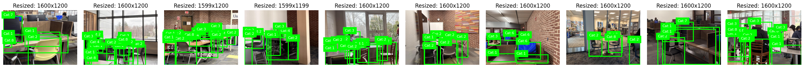
    


### Visualizing Polygons
- also checking that pixel-level masking was conserved correctly with transformations


```python

from pycocotools import mask as mask_utils

def verify_full_annotations(num_samples=5, alpha=0.5):
    img_to_anns = {img['id']: [] for img in resized_coco['images']}
    for ann in resized_coco['annotations']:
        img_to_anns[ann['image_id']].append(ann)

    sample_images = random.sample(resized_coco['images'], num_samples)
    fig, axes = plt.subplots(1, num_samples, figsize=(25, 10))
    if num_samples == 1: axes = [axes]

    for i, img_info in enumerate(sample_images):
        img_path = os.path.join(RESIZED_IMG_DIR, img_info['file_name'])
        img = Image.open(img_path)
        axes[i].imshow(img)

        anns = img_to_anns.get(img_info['id'], [])

        for ann in anns:
            #boundin box
            x, y, w, h = ann['bbox']
            rect = patches.Rectangle((x, y), w, h, linewidth=1,
                                     edgecolor='lime', facecolor='none', linestyle='--')
            axes[i].add_patch(rect)

            #segmentations in magenta
            seg = ann['segmentation']

            #standard polys
            if isinstance(seg, list):
                for polygon in seg:
                    poly = np.array(polygon).reshape((len(polygon) // 2, 2))
                    axes[i].add_patch(Polygon(poly, closed=True, edgecolor='magenta',
                                              facecolor='magenta', alpha=alpha))

            #bitmask (export from CVAT)
            elif isinstance(seg, dict):
                try:
                    #decode binary
                    binary_mask = mask_utils.decode(seg)

                    #magenta
                    mask_overlay = np.zeros((binary_mask.shape[0], binary_mask.shape[1], 4))
                    mask_overlay[binary_mask == 1] = [1, 0, 1, alpha] # [R, G, B, Alpha]

                    axes[i].imshow(mask_overlay)
                except Exception as e: #exception to not do this if there is an error with RLE encoding
                    axes[i].text(x, y+h+10, "RLE Size Error", color='red', fontsize=8, backgroundcolor='white')

        axes[i].set_title(f"Image ID: {img_info['id']}")
        axes[i].axis('off')

    plt.tight_layout()
    plt.show()

verify_full_annotations(num_samples=3)
```


    
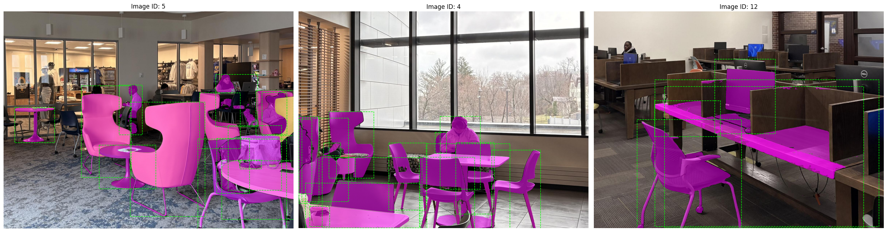
    


```python
#verifying again before training
images, targets = next(iter(train_loader))

#first img in bacth
plt.imshow(images[0].permute(1, 2, 0).cpu().numpy()) # Simplified plot
```

    WARNING:matplotlib.image:Clipping input data to the valid range for imshow with RGB data ([0..1] for floats or [0..255] for integers). Got range [-2.117904..1.78597].


    <matplotlib.image.AxesImage at 0x7dba272706b0>


    
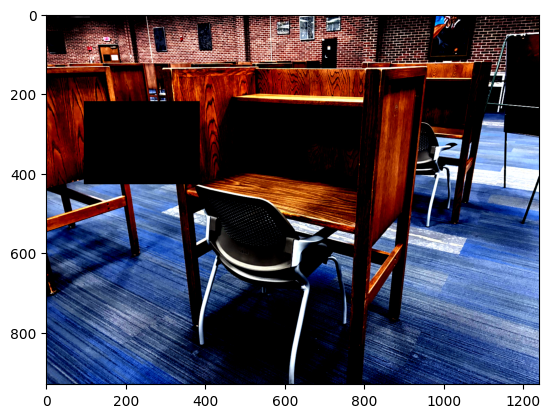
    


```python
import matplotlib.pyplot as plt
import matplotlib.patches as patches
import numpy as np

def verify_batch(images, targets, index=0):
    img_tensor = images[index].cpu()
    target = targets[index]

    mean = np.array([0.485, 0.456, 0.406])
    std = np.array([0.229, 0.224, 0.225])
    img = img_tensor.permute(1, 2, 0).numpy()
    img = (img * std) + mean
    img = np.clip(img, 0, 1)

    plt.figure(figsize=(12, 8))
    plt.imshow(img)
    ax = plt.gca()

    if 'boxes' in target:
        for box, label in zip(target['boxes'], target['labels']):
            xmin, ymin, xmax, ymax = box.cpu().numpy()
            rect = patches.Rectangle((xmin, ymin), xmax-xmin, ymax-ymin,
                                     linewidth=2, edgecolor='lime', facecolor='none')
            ax.add_patch(rect)
            ax.text(xmin, ymin-5, f"ID:{label.item()}", color='white',
                    fontsize=8, backgroundcolor='lime')

    if 'masks' in target:
        combined_mask = torch.sum(target['masks'], dim=0).cpu().numpy()
        combined_mask = np.where(combined_mask > 0, 0.5, 0) # Make it semi-transparent
        ax.imshow(combined_mask, cmap='magma', alpha=0.3)

    plt.title(f"Augmented Training Sample (Color Jitter + Spatial Transforms)")
    plt.axis('off')
    plt.show()

images, targets = next(iter(train_loader))
verify_batch(images, targets, index=0)
```

### Loading MaskRCNN Weights and Model

- DEFAULT are the default pretrained weights from COCO V1


```python
weights = torchvision.models.detection.MaskRCNN_ResNet50_FPN_Weights.DEFAULT
weights = MaskRCNN_ResNet50_FPN_Weights.DEFAULT #COCO V1 weights
baseline_model = maskrcnn_resnet50_fpn(weights=weights)
```

    Downloading: "https://download.pytorch.org/models/maskrcnn_resnet50_fpn_coco-bf2d0c1e.pth" to /root/.cache/torch/hub/checkpoints/maskrcnn_resnet50_fpn_coco-bf2d0c1e.pth


    100%|██████████| 170M/170M [00:00<00:00, 230MB/s]


### Modifying MaskRCNN Model to fit Speicfc Task


```python
baseline_model.roi_heads.box_predictor.cls_score = nn.Linear(in_features=1024, out_features=9) #setting to 9 for the labels
baseline_model.roi_heads.box_predictor.bbox_pred = nn.Linear(in_features=1024, out_features=36) #setting to 9*4
baseline_model.roi_heads.mask_predictor.mask_fcn_logits = nn.Conv2d(256, 9, kernel_size=(1,1), stride=(1,1)) #fully connected lauer
```

### Checking correct dimensions for 9-object segmentation task


```python
print(baseline_model.roi_heads.box_predictor.cls_score)
print(baseline_model.roi_heads.mask_predictor.mask_fcn_logits)
#both updated to 9 now for output
```

    Linear(in_features=1024, out_features=9, bias=True)
    Conv2d(256, 9, kernel_size=(1, 1), stride=(1, 1))


### Baseline Model with 9 Output Heads


```python
device = torch.device('cuda') if torch.cuda.is_available() else torch.device('cpu')
print(f"Using device: {device}")
```

    Using device: cuda


```python
baseline_model.to(device)
```


    MaskRCNN(
      (transform): GeneralizedRCNNTransform(
          Normalize(mean=[0.485, 0.456, 0.406], std=[0.229, 0.224, 0.225])
          Resize(min_size=(800,), max_size=1333, mode='bilinear')
      )
      (backbone): BackboneWithFPN(
        (body): IntermediateLayerGetter(
          (conv1): Conv2d(3, 64, kernel_size=(7, 7), stride=(2, 2), padding=(3, 3), bias=False)
          (bn1): FrozenBatchNorm2d(64, eps=0.0)
          (relu): ReLU(inplace=True)
          (maxpool): MaxPool2d(kernel_size=3, stride=2, padding=1, dilation=1, ceil_mode=False)
          (layer1): Sequential(
            (0): Bottleneck(
              (conv1): Conv2d(64, 64, kernel_size=(1, 1), stride=(1, 1), bias=False)
              (bn1): FrozenBatchNorm2d(64, eps=0.0)
              (conv2): Conv2d(64, 64, kernel_size=(3, 3), stride=(1, 1), padding=(1, 1), bias=False)
              (bn2): FrozenBatchNorm2d(64, eps=0.0)
              (conv3): Conv2d(64, 256, kernel_size=(1, 1), stride=(1, 1), bias=False)
              (bn3): FrozenBatchNorm2d(256, eps=0.0)
              (relu): ReLU(inplace=True)
              (downsample): Sequential(
                (0): Conv2d(64, 256, kernel_size=(1, 1), stride=(1, 1), bias=False)
                (1): FrozenBatchNorm2d(256, eps=0.0)
              )
            )
            (1): Bottleneck(
              (conv1): Conv2d(256, 64, kernel_size=(1, 1), stride=(1, 1), bias=False)
              (bn1): FrozenBatchNorm2d(64, eps=0.0)
              (conv2): Conv2d(64, 64, kernel_size=(3, 3), stride=(1, 1), padding=(1, 1), bias=False)
              (bn2): FrozenBatchNorm2d(64, eps=0.0)
              (conv3): Conv2d(64, 256, kernel_size=(1, 1), stride=(1, 1), bias=False)
              (bn3): FrozenBatchNorm2d(256, eps=0.0)
              (relu): ReLU(inplace=True)
            )
            (2): Bottleneck(
              (conv1): Conv2d(256, 64, kernel_size=(1, 1), stride=(1, 1), bias=False)
              (bn1): FrozenBatchNorm2d(64, eps=0.0)
              (conv2): Conv2d(64, 64, kernel_size=(3, 3), stride=(1, 1), padding=(1, 1), bias=False)
              (bn2): FrozenBatchNorm2d(64, eps=0.0)
              (conv3): Conv2d(64, 256, kernel_size=(1, 1), stride=(1, 1), bias=False)
              (bn3): FrozenBatchNorm2d(256, eps=0.0)
              (relu): ReLU(inplace=True)
            )
          )
          (layer2): Sequential(
            (0): Bottleneck(
              (conv1): Conv2d(256, 128, kernel_size=(1, 1), stride=(1, 1), bias=False)
              (bn1): FrozenBatchNorm2d(128, eps=0.0)
              (conv2): Conv2d(128, 128, kernel_size=(3, 3), stride=(2, 2), padding=(1, 1), bias=False)
              (bn2): FrozenBatchNorm2d(128, eps=0.0)
              (conv3): Conv2d(128, 512, kernel_size=(1, 1), stride=(1, 1), bias=False)
              (bn3): FrozenBatchNorm2d(512, eps=0.0)
              (relu): ReLU(inplace=True)
              (downsample): Sequential(
                (0): Conv2d(256, 512, kernel_size=(1, 1), stride=(2, 2), bias=False)
                (1): FrozenBatchNorm2d(512, eps=0.0)
              )
            )
            (1): Bottleneck(
              (conv1): Conv2d(512, 128, kernel_size=(1, 1), stride=(1, 1), bias=False)
              (bn1): FrozenBatchNorm2d(128, eps=0.0)
              (conv2): Conv2d(128, 128, kernel_size=(3, 3), stride=(1, 1), padding=(1, 1), bias=False)
              (bn2): FrozenBatchNorm2d(128, eps=0.0)
              (conv3): Conv2d(128, 512, kernel_size=(1, 1), stride=(1, 1), bias=False)
              (bn3): FrozenBatchNorm2d(512, eps=0.0)
              (relu): ReLU(inplace=True)
            )
            (2): Bottleneck(
              (conv1): Conv2d(512, 128, kernel_size=(1, 1), stride=(1, 1), bias=False)
              (bn1): FrozenBatchNorm2d(128, eps=0.0)
              (conv2): Conv2d(128, 128, kernel_size=(3, 3), stride=(1, 1), padding=(1, 1), bias=False)
              (bn2): FrozenBatchNorm2d(128, eps=0.0)
              (conv3): Conv2d(128, 512, kernel_size=(1, 1), stride=(1, 1), bias=False)
              (bn3): FrozenBatchNorm2d(512, eps=0.0)
              (relu): ReLU(inplace=True)
            )
            (3): Bottleneck(
              (conv1): Conv2d(512, 128, kernel_size=(1, 1), stride=(1, 1), bias=False)
              (bn1): FrozenBatchNorm2d(128, eps=0.0)
              (conv2): Conv2d(128, 128, kernel_size=(3, 3), stride=(1, 1), padding=(1, 1), bias=False)
              (bn2): FrozenBatchNorm2d(128, eps=0.0)
              (conv3): Conv2d(128, 512, kernel_size=(1, 1), stride=(1, 1), bias=False)
              (bn3): FrozenBatchNorm2d(512, eps=0.0)
              (relu): ReLU(inplace=True)
            )
          )
          (layer3): Sequential(
            (0): Bottleneck(
              (conv1): Conv2d(512, 256, kernel_size=(1, 1), stride=(1, 1), bias=False)
              (bn1): FrozenBatchNorm2d(256, eps=0.0)
              (conv2): Conv2d(256, 256, kernel_size=(3, 3), stride=(2, 2), padding=(1, 1), bias=False)
              (bn2): FrozenBatchNorm2d(256, eps=0.0)
              (conv3): Conv2d(256, 1024, kernel_size=(1, 1), stride=(1, 1), bias=False)
              (bn3): FrozenBatchNorm2d(1024, eps=0.0)
              (relu): ReLU(inplace=True)
              (downsample): Sequential(
                (0): Conv2d(512, 1024, kernel_size=(1, 1), stride=(2, 2), bias=False)
                (1): FrozenBatchNorm2d(1024, eps=0.0)
              )
            )
            (1): Bottleneck(
              (conv1): Conv2d(1024, 256, kernel_size=(1, 1), stride=(1, 1), bias=False)
              (bn1): FrozenBatchNorm2d(256, eps=0.0)
              (conv2): Conv2d(256, 256, kernel_size=(3, 3), stride=(1, 1), padding=(1, 1), bias=False)
              (bn2): FrozenBatchNorm2d(256, eps=0.0)
              (conv3): Conv2d(256, 1024, kernel_size=(1, 1), stride=(1, 1), bias=False)
              (bn3): FrozenBatchNorm2d(1024, eps=0.0)
              (relu): ReLU(inplace=True)
            )
            (2): Bottleneck(
              (conv1): Conv2d(1024, 256, kernel_size=(1, 1), stride=(1, 1), bias=False)
              (bn1): FrozenBatchNorm2d(256, eps=0.0)
              (conv2): Conv2d(256, 256, kernel_size=(3, 3), stride=(1, 1), padding=(1, 1), bias=False)
              (bn2): FrozenBatchNorm2d(256, eps=0.0)
              (conv3): Conv2d(256, 1024, kernel_size=(1, 1), stride=(1, 1), bias=False)
              (bn3): FrozenBatchNorm2d(1024, eps=0.0)
              (relu): ReLU(inplace=True)
            )
            (3): Bottleneck(
              (conv1): Conv2d(1024, 256, kernel_size=(1, 1), stride=(1, 1), bias=False)
              (bn1): FrozenBatchNorm2d(256, eps=0.0)
              (conv2): Conv2d(256, 256, kernel_size=(3, 3), stride=(1, 1), padding=(1, 1), bias=False)
              (bn2): FrozenBatchNorm2d(256, eps=0.0)
              (conv3): Conv2d(256, 1024, kernel_size=(1, 1), stride=(1, 1), bias=False)
              (bn3): FrozenBatchNorm2d(1024, eps=0.0)
              (relu): ReLU(inplace=True)
            )
            (4): Bottleneck(
              (conv1): Conv2d(1024, 256, kernel_size=(1, 1), stride=(1, 1), bias=False)
              (bn1): FrozenBatchNorm2d(256, eps=0.0)
              (conv2): Conv2d(256, 256, kernel_size=(3, 3), stride=(1, 1), padding=(1, 1), bias=False)
              (bn2): FrozenBatchNorm2d(256, eps=0.0)
              (conv3): Conv2d(256, 1024, kernel_size=(1, 1), stride=(1, 1), bias=False)
              (bn3): FrozenBatchNorm2d(1024, eps=0.0)
              (relu): ReLU(inplace=True)
            )
            (5): Bottleneck(
              (conv1): Conv2d(1024, 256, kernel_size=(1, 1), stride=(1, 1), bias=False)
              (bn1): FrozenBatchNorm2d(256, eps=0.0)
              (conv2): Conv2d(256, 256, kernel_size=(3, 3), stride=(1, 1), padding=(1, 1), bias=False)
              (bn2): FrozenBatchNorm2d(256, eps=0.0)
              (conv3): Conv2d(256, 1024, kernel_size=(1, 1), stride=(1, 1), bias=False)
              (bn3): FrozenBatchNorm2d(1024, eps=0.0)
              (relu): ReLU(inplace=True)
            )
          )
          (layer4): Sequential(
            (0): Bottleneck(
              (conv1): Conv2d(1024, 512, kernel_size=(1, 1), stride=(1, 1), bias=False)
              (bn1): FrozenBatchNorm2d(512, eps=0.0)
              (conv2): Conv2d(512, 512, kernel_size=(3, 3), stride=(2, 2), padding=(1, 1), bias=False)
              (bn2): FrozenBatchNorm2d(512, eps=0.0)
              (conv3): Conv2d(512, 2048, kernel_size=(1, 1), stride=(1, 1), bias=False)
              (bn3): FrozenBatchNorm2d(2048, eps=0.0)
              (relu): ReLU(inplace=True)
              (downsample): Sequential(
                (0): Conv2d(1024, 2048, kernel_size=(1, 1), stride=(2, 2), bias=False)
                (1): FrozenBatchNorm2d(2048, eps=0.0)
              )
            )
            (1): Bottleneck(
              (conv1): Conv2d(2048, 512, kernel_size=(1, 1), stride=(1, 1), bias=False)
              (bn1): FrozenBatchNorm2d(512, eps=0.0)
              (conv2): Conv2d(512, 512, kernel_size=(3, 3), stride=(1, 1), padding=(1, 1), bias=False)
              (bn2): FrozenBatchNorm2d(512, eps=0.0)
              (conv3): Conv2d(512, 2048, kernel_size=(1, 1), stride=(1, 1), bias=False)
              (bn3): FrozenBatchNorm2d(2048, eps=0.0)
              (relu): ReLU(inplace=True)
            )
            (2): Bottleneck(
              (conv1): Conv2d(2048, 512, kernel_size=(1, 1), stride=(1, 1), bias=False)
              (bn1): FrozenBatchNorm2d(512, eps=0.0)
              (conv2): Conv2d(512, 512, kernel_size=(3, 3), stride=(1, 1), padding=(1, 1), bias=False)
              (bn2): FrozenBatchNorm2d(512, eps=0.0)
              (conv3): Conv2d(512, 2048, kernel_size=(1, 1), stride=(1, 1), bias=False)
              (bn3): FrozenBatchNorm2d(2048, eps=0.0)
              (relu): ReLU(inplace=True)
            )
          )
        )
        (fpn): FeaturePyramidNetwork(
          (inner_blocks): ModuleList(
            (0): Conv2dNormActivation(
              (0): Conv2d(256, 256, kernel_size=(1, 1), stride=(1, 1))
            )
            (1): Conv2dNormActivation(
              (0): Conv2d(512, 256, kernel_size=(1, 1), stride=(1, 1))
            )
            (2): Conv2dNormActivation(
              (0): Conv2d(1024, 256, kernel_size=(1, 1), stride=(1, 1))
            )
            (3): Conv2dNormActivation(
              (0): Conv2d(2048, 256, kernel_size=(1, 1), stride=(1, 1))
            )
          )
          (layer_blocks): ModuleList(
            (0-3): 4 x Conv2dNormActivation(
              (0): Conv2d(256, 256, kernel_size=(3, 3), stride=(1, 1), padding=(1, 1))
            )
          )
          (extra_blocks): LastLevelMaxPool()
        )
      )
      (rpn): RegionProposalNetwork(
        (anchor_generator): AnchorGenerator()
        (head): RPNHead(
          (conv): Sequential(
            (0): Conv2dNormActivation(
              (0): Conv2d(256, 256, kernel_size=(3, 3), stride=(1, 1), padding=(1, 1))
              (1): ReLU(inplace=True)
            )
          )
          (cls_logits): Conv2d(256, 3, kernel_size=(1, 1), stride=(1, 1))
          (bbox_pred): Conv2d(256, 12, kernel_size=(1, 1), stride=(1, 1))
        )
      )
      (roi_heads): RoIHeads(
        (box_roi_pool): MultiScaleRoIAlign(featmap_names=['0', '1', '2', '3'], output_size=(7, 7), sampling_ratio=2)
        (box_head): TwoMLPHead(
          (fc6): Linear(in_features=12544, out_features=1024, bias=True)
          (fc7): Linear(in_features=1024, out_features=1024, bias=True)
        )
        (box_predictor): FastRCNNPredictor(
          (cls_score): Linear(in_features=1024, out_features=9, bias=True)
          (bbox_pred): Linear(in_features=1024, out_features=36, bias=True)
        )
        (mask_roi_pool): MultiScaleRoIAlign(featmap_names=['0', '1', '2', '3'], output_size=(14, 14), sampling_ratio=2)
        (mask_head): MaskRCNNHeads(
          (0): Conv2dNormActivation(
            (0): Conv2d(256, 256, kernel_size=(3, 3), stride=(1, 1), padding=(1, 1))
            (1): ReLU(inplace=True)
          )
          (1): Conv2dNormActivation(
            (0): Conv2d(256, 256, kernel_size=(3, 3), stride=(1, 1), padding=(1, 1))
            (1): ReLU(inplace=True)
          )
          (2): Conv2dNormActivation(
            (0): Conv2d(256, 256, kernel_size=(3, 3), stride=(1, 1), padding=(1, 1))
            (1): ReLU(inplace=True)
          )
          (3): Conv2dNormActivation(
            (0): Conv2d(256, 256, kernel_size=(3, 3), stride=(1, 1), padding=(1, 1))
            (1): ReLU(inplace=True)
          )
        )
        (mask_predictor): MaskRCNNPredictor(
          (conv5_mask): ConvTranspose2d(256, 256, kernel_size=(2, 2), stride=(2, 2))
          (relu): ReLU(inplace=True)
          (mask_fcn_logits): Conv2d(256, 9, kernel_size=(1, 1), stride=(1, 1))
        )
      )
    )


## Evaluating Baseline Performance (No Training)  
- Custom Helper Functions to Compute Pixel-Level Intersection Over Union (Mask Performance), and Instance Intersection Over Union (Box IoU)

- PyTorch only has the Box IoU built-in function torchvision.ops.box_iou


```python

def evaluate_pixel_iou(model, data_loader, device, threshold=0.5):
    model.eval() #set to evaluation mode
    total_iou = 0
    num_images = 0

    with torch.no_grad(): #no training just evaluating iou
        for images, targets in data_loader:
            images = [img.to(device) for img in images]
            outputs = model(images)

            for i in range(len(images)):
                #ground truth masks
                gt_masks = targets[i]['masks'].to(device)
                if gt_masks.shape[0] == 0:
                    continue

                H, W = gt_masks.shape[-2:] #height and width of the ground truth masks

                #binary map
                full_gt_map = (gt_masks.sum(dim=0) > 0).float()

                #predictions
                pred_masks = outputs[i]['masks']

                if pred_masks.shape[0] > 0:
                    pred_masks = pred_masks.squeeze(1)

                    #matching spatials - if it's not an exact match, do the nearest neighbour interpolation
                    if pred_masks.shape[-2:] != (H, W):
                        pred_masks = F.interpolate(
                            pred_masks.unsqueeze(1),
                            size=(H, W),
                            mode="nearest"
                        ).squeeze(1)

                    #combine preds
                    full_pred_map = (pred_masks.sum(dim=0) > threshold).float()
                else:
                    full_pred_map = torch.zeros((H, W), device=device)

                #IoU calculation for masks
                intersection = (full_pred_map * full_gt_map).sum() #intesection
                union = (full_pred_map + full_gt_map).clamp(0, 1).sum() #ground truth map + predicted map union

                iou = intersection / (union + 1e-6) #small noise to avoid zero div error
                total_iou += iou.item()
                num_images += 1

    avg_iou = total_iou / num_images if num_images > 0 else 0
    return avg_iou
```


```python
baseline_training_iou = evaluate_pixel_iou(baseline_model, data_loader=train_loader, device=device)
```


```python
baseline_validation_iou = evaluate_pixel_iou(baseline_model, data_loader=val_loader, device=device)
```


```python
print("Baseline Training IoU=", baseline_training_iou)
print("Baseline Validation IoU=", baseline_validation_iou)
```

    Baseline Training IoU= 0.19648550979533716
    Baseline Validation IoU= 0.1599959689192474


Baseline Pixelwise IOU (masks):
- Training=0.196
- Validation=0.159


```python
#computing box IoU (much more strict measure of IoU)

from torchvision.ops import box_iou

@torch.no_grad()
def evaluate_strict_iou(model, data_loader, device, score_threshold=0.2, iou_threshold=0.5):
    model.eval()
    matches = 0
    total_gt_objects = 0

    for images, targets in data_loader:
        images = list(img.to(device) for img in images)
        outputs = model(images)

        for i, output in enumerate(outputs):
            #filter by conf scores
            keep = output['scores'] > score_threshold
            pred_boxes = output['boxes'][keep]

            gt_boxes = targets[i]['boxes'].to(device)
            total_gt_objects += len(gt_boxes)

            if len(pred_boxes) > 0 and len(gt_boxes) > 0:
                #computes IoU
                iou_matrix = box_iou(pred_boxes, gt_boxes) #built in function

                #best predicted IoU
                max_ious_per_gt, _ = iou_matrix.max(dim=0)

                #only if IoU >= 0.5 (Accoridng to He et al method)
                matches += (max_ious_per_gt >= iou_threshold).sum().item()

    model.train() #back to train mode


    return matches / total_gt_objects if total_gt_objects > 0 else 0.0
```


```python
baseline_training_iou_box = evaluate_strict_iou(baseline_model, data_loader=train_loader, device=device)
print(baseline_training_iou_box)

baseline_validation_iou_box = evaluate_strict_iou(baseline_model, data_loader=val_loader, device=device)
print(baseline_validation_iou_box)

```

    0.15412186379928317
    0.14124293785310735


- Baseline Training Box IoU: 0.154
- Baseline Validation Box IoU: 0.141

### Baseline Loss


```python
def calculate_baseline_loss(model, data_loader, device):
    baseline_model.train() #training mode to compute loss
    total_loss = 0 #initialize

    with torch.no_grad(): #no training
        for images, targets in data_loader:
            images = [img.to(device) for img in images] #moving to gpu
            targets = [{k: v.to(device) for k, v in t.items()} for t in targets]

            loss_dict = model(images, targets) #compute loss
            losses = sum(loss for loss in loss_dict.values()) #composite multitask loss (sum of losses)
            total_loss += losses.item()

    return total_loss / len(data_loader)

#training loss
avg_train_loss = calculate_baseline_loss(baseline_model, train_loader, device)

#validation loss
avg_val_loss = calculate_baseline_loss(baseline_model, val_loader, device)

print("Average Baseline Training Loss: ", avg_train_loss)
print("Average Baseline Validation Loss ", avg_val_loss)
```


    ---------------------------------------------------------------------------

    NameError                                 Traceback (most recent call last)

    /tmp/ipykernel_8556/799027091.py in <cell line: 0>()
         15 
         16 #training loss
    ---> 17 avg_train_loss = calculate_baseline_loss(baseline_model, train_loader, device)
         18 
         19 #validation loss


    NameError: name 'baseline_model' is not defined


Average training loss is quite low - 2.679 (overfitting a lot), but baseline average validation loss is 13.30.

### Training Loop using Cuda, SGD and Baseline Hyperparams (From He et al. 2017)
- LR = 0.02
- Mom = 0.9
- Weight Decay = 0.0001


```python
scaler = torch.amp.GradScaler('cuda') #cuda specific scaler to help with GPU

params = [p for p in baseline_model.parameters() if p.requires_grad]
optimizer = torch.optim.SGD(params, lr=0.02, momentum=0.9, weight_decay=0.0001)

num_epochs = 3 #3 epochs to see trend first
baseline_model.to(device)


for epoch in range(num_epochs):
    baseline_model.train()
    epoch_loss = 0

    for i, (images, targets) in enumerate(train_loader):
        images = list(image.to(device) for image in images)
        targets = [{k: v.to(device) for k, v in t.items()} for t in targets]


        with torch.amp.autocast('cuda'):
            loss_dict = baseline_model(images, targets)
            losses = sum(loss for loss in loss_dict.values())

        #if nan
        if torch.isnan(losses):
            print(f"\nNaN at Epoch {epoch+1}, Batch {i}")
            print("Loss:", {k: round(v.item(), 4) for k, v in loss_dict.items()})
            continue #skip batch if nan

        scaler.scale(losses).backward()

        #unscale
        scaler.unscale_(optimizer)
        torch.nn.utils.clip_grad_norm_(baseline_model.parameters(), max_norm=1.0)

        scaler.step(optimizer)
        scaler.update()
        optimizer.zero_grad()

        epoch_loss += losses.item()

    avg_loss = epoch_loss / len(train_loader)
    print(f"Epoch {epoch+1:02d}, Avg Loss: {avg_loss:.4f}")
```

    Epoch 01, Avg Loss: 2.7575
    Epoch 02, Avg Loss: 1.7283
    Epoch 03, Avg Loss: 1.4234


Loss is decreasing pretty well already with default Mask R-CNN hyperparameters.

## Random Search for Optimal SGD Hyperparameters


```python
def get_model_instance_segmentation(num_classes):
    model = torchvision.models.detection.maskrcnn_resnet50_fpn(
        weights="DEFAULT" #COCO V1 weights
    )

    in_features = model.roi_heads.box_predictor.cls_score.in_features

    model.roi_heads.box_predictor = FastRCNNPredictor(in_features, num_classes)

    in_features_mask = model.roi_heads.mask_predictor.conv5_mask.in_channels
    hidden_layer = 256

    model.roi_heads.mask_predictor = MaskRCNNPredictor(
        in_features_mask,
        hidden_layer,
        num_classes
    )

    return model
```


```python


def run_random_trial(trial_id, lr, momentum, wd, epochs=5):
    print(f"Trial {trial_id} | LR: {lr:.6e} | Mom: {momentum:.4f} | WD: {wd:.6e}")

    model = get_model_instance_segmentation(num_classes=9).to(device)
    optimizer = torch.optim.SGD([p for p in model.parameters() if p.requires_grad],
                                lr=lr, momentum=momentum, weight_decay=wd)
    scaler = torch.amp.GradScaler('cuda')

    total_trial_loss = 0.0
    total_steps = 0

    for epoch in range(epochs):
        model.train()
        epoch_loss = 0.0
        for images, targets in train_loader:
            images = [img.to(device) for img in images]
            targets = [{k: v.to(device) for k, v in t.items()} for t in targets]

            with torch.amp.autocast('cuda'):
                loss_dict = model(images, targets)
                losses = sum(loss for loss in loss_dict.values())

            optimizer.zero_grad()
            scaler.scale(losses).backward()
            scaler.step(optimizer)
            scaler.update()

            epoch_loss += losses.item()
            total_steps += 1

        total_trial_loss += epoch_loss

    #average loss
    avg_loss = total_trial_loss / total_steps

    #evaluation
    i_iou = evaluate_strict_iou(model, val_loader, device)
    p_iou = evaluate_pixel_iou(model, val_loader, device)

    del model, optimizer, scaler
    gc.collect()
    torch.cuda.empty_cache()

    return {"i_iou": i_iou, "p_iou": p_iou, "avg_loss": avg_loss}
```


```python
num_trials = 5
results = []
set_seed(42)

for i in range(1, num_trials + 1):
    #log sampling for lr and wd
    lr = 10**random.uniform(-5, -2.5)
    wd = 10**random.uniform(-6, -3)
    mom = random.uniform(0.85, 0.99)

    metrics = run_random_trial(i, lr, mom, wd, epochs=5)

    results.append({
        "trial": i,
        "lr": lr,
        "momentum": mom,
        "weight_decay": wd,
        "avg_loss": metrics["avg_loss"],
        "i_iou": metrics["i_iou"],
        "p_iou": metrics["p_iou"],
        "score": (metrics["i_iou"] + metrics["p_iou"]) - (metrics["avg_loss"] * 0.1)
    })

#df for visualization later
df_results = pd.DataFrame(results).sort_values(by="score", ascending=False)

print("Random search best hyperparams")
print(df_results[['trial', 'lr', 'avg_loss', 'i_iou', 'p_iou', 'score']].head(5))

best_params = df_results.iloc[0]
```

    Trial 1 | LR: 3.967957e-04 | Mom: 0.8885 | WD: 1.188591e-06
    Trial 2 | LR: 3.614322e-05 | Mom: 0.9447 | WD: 1.619622e-04
    Trial 3 | LR: 1.700000e-03 | Mom: 0.9091 | WD: 1.823125e-06
    Trial 4 | LR: 1.187116e-05 | Mom: 0.9207 | WD: 4.528078e-06
    Trial 5 | LR: 1.165038e-05 | Mom: 0.9410 | WD: 3.949235e-06
    Random search best hyperparams
       trial        lr  avg_loss     i_iou     p_iou     score
    2      3  0.001700  1.707093  0.779661  0.549086  1.158038
    0      1  0.000397  2.173763  0.649718  0.522429  0.954770
    1      2  0.000036  2.717064  0.028249  0.313211  0.069753
    4      5  0.000012  2.975696  0.000000  0.262133 -0.035437
    3      4  0.000012  3.223178  0.000000  0.265221 -0.057097


Best hyperparameter combination from random search:

- lr = 0.0017
- momentum = 0.909
- weight decay = 0.00002

### Experiment 1: Training and Fine-Tuning with Best Hyperparameters
- 50 epochs
- LR = 0.0017, Momentum = 0.909, Weight Decay = 0.00002


```python
import torch.amp as amp

num_epochs = 50
val_frequency = 5
device = torch.device('cuda') if torch.cuda.is_available() else torch.device('cpu')

#Best Params from Grid Search
best_lr = 0.0017
best_mom = 0.909
best_wd = 0.00002

#initilaizing
model = get_model_instance_segmentation(num_classes=9).to(device)
optimizer = torch.optim.SGD([p for p in model.parameters() if p.requires_grad],
                            lr=best_lr, momentum=best_mom, weight_decay=best_wd)
scaler = amp.GradScaler('cuda')

#save history for plotting
history = {
    "train_loss": [],
    "val_loss": [],
    "pixel_iou": [],
    "instance_iou": [],
    "epochs": []
}

for epoch in range(num_epochs):
    #every epoch calculate training loss
    model.train() #training mode
    epoch_train_loss = 0

    for images, targets in train_loader:
        images = [img.to(device) for img in images]
        targets = [{k: v.to(device) for k, v in t.items()} for t in targets]

        with amp.autocast('cuda'):
            loss_dict = model(images, targets)
            losses = sum(loss for loss in loss_dict.values())

        optimizer.zero_grad()
        scaler.scale(losses).backward()
        scaler.step(optimizer)
        scaler.update()
        epoch_train_loss += losses.item()

    avg_train_loss = epoch_train_loss / len(train_loader)
    history["train_loss"].append(avg_train_loss)
    history["epochs"].append(epoch + 1)

    #validation
    if (epoch + 1) % val_frequency == 0 or epoch == 0:
        #validation loss
        model.train() #train mode
        epoch_val_loss = 0
        with torch.no_grad():
            for images, targets in val_loader:
                images = [img.to(device) for img in images]
                targets = [{k: v.to(device) for k, v in t.items()} for t in targets]

                with amp.autocast('cuda'):
                    val_loss_dict = model(images, targets)
                    val_losses = sum(loss for loss in val_loss_dict.values())
                epoch_val_loss += val_losses.item()

        avg_val_loss = epoch_val_loss / len(val_loader)
        history["val_loss"].append(avg_val_loss)

        #Global Pixel-wise IoU
        p_iou = evaluate_pixel_iou(model, val_loader, device, threshold=0.5)
        history["pixel_iou"].append(p_iou)

        #Instance box IoU
        i_iou = evaluate_strict_iou(model, val_loader, device)
        history["instance_iou"].append(i_iou)

        print(f"Epoch {epoch+1:02d} | T-Loss: {avg_train_loss:.4f} | V-Loss: {avg_val_loss:.4f} | P-IoU: {p_iou:.4f} | I-IoU: {i_iou:.4f}")
    else:
        print(f"   Epoch {epoch+1:02d} | T-Loss: {avg_train_loss:.4f} (Skipping Val)")


print("Training complete.")
```

    Epoch 01 | T-Loss: 2.8551 | V-Loss: 2.2573 | P-IoU: 0.4167 | I-IoU: 0.6328
       Epoch 02 | T-Loss: 1.9196 (Skipping Val)
       Epoch 03 | T-Loss: 1.5989 (Skipping Val)
       Epoch 04 | T-Loss: 1.3899 (Skipping Val)
    Epoch 05 | T-Loss: 1.2972 | V-Loss: 1.5790 | P-IoU: 0.5499 | I-IoU: 0.8023
       Epoch 06 | T-Loss: 1.1693 (Skipping Val)
       Epoch 07 | T-Loss: 1.1068 (Skipping Val)
       Epoch 08 | T-Loss: 1.0372 (Skipping Val)
       Epoch 09 | T-Loss: 0.9722 (Skipping Val)
    Epoch 10 | T-Loss: 0.9235 | V-Loss: 1.6599 | P-IoU: 0.6405 | I-IoU: 0.7514
       Epoch 11 | T-Loss: 0.8652 (Skipping Val)
       Epoch 12 | T-Loss: 0.8286 (Skipping Val)
       Epoch 13 | T-Loss: 0.7934 (Skipping Val)
       Epoch 14 | T-Loss: 0.7796 (Skipping Val)
    Epoch 15 | T-Loss: 0.7488 | V-Loss: 1.6899 | P-IoU: 0.6577 | I-IoU: 0.7401
       Epoch 16 | T-Loss: 0.7136 (Skipping Val)
       Epoch 17 | T-Loss: 0.6839 (Skipping Val)
       Epoch 18 | T-Loss: 0.6644 (Skipping Val)
       Epoch 19 | T-Loss: 0.6564 (Skipping Val)
    Epoch 20 | T-Loss: 0.6287 | V-Loss: 1.8116 | P-IoU: 0.6435 | I-IoU: 0.7345
       Epoch 21 | T-Loss: 0.6084 (Skipping Val)
       Epoch 22 | T-Loss: 0.6160 (Skipping Val)
       Epoch 23 | T-Loss: 0.5865 (Skipping Val)
       Epoch 24 | T-Loss: 0.5759 (Skipping Val)
    Epoch 25 | T-Loss: 0.5656 | V-Loss: 1.7500 | P-IoU: 0.6496 | I-IoU: 0.7571
       Epoch 26 | T-Loss: 0.5595 (Skipping Val)
       Epoch 27 | T-Loss: 0.5433 (Skipping Val)
       Epoch 28 | T-Loss: 0.5382 (Skipping Val)
       Epoch 29 | T-Loss: 0.5186 (Skipping Val)
    Epoch 30 | T-Loss: 0.5260 | V-Loss: 1.8952 | P-IoU: 0.6599 | I-IoU: 0.7175
       Epoch 31 | T-Loss: 0.5306 (Skipping Val)
       Epoch 32 | T-Loss: 0.5138 (Skipping Val)
       Epoch 33 | T-Loss: 0.5042 (Skipping Val)
       Epoch 34 | T-Loss: 0.4830 (Skipping Val)
    Epoch 35 | T-Loss: 0.4642 | V-Loss: 1.9044 | P-IoU: 0.6810 | I-IoU: 0.7119
       Epoch 36 | T-Loss: 0.4603 (Skipping Val)
       Epoch 37 | T-Loss: 0.4534 (Skipping Val)
       Epoch 38 | T-Loss: 0.4489 (Skipping Val)
       Epoch 39 | T-Loss: 0.4468 (Skipping Val)
    Epoch 40 | T-Loss: 0.4500 | V-Loss: 2.0163 | P-IoU: 0.6636 | I-IoU: 0.7119
       Epoch 41 | T-Loss: 0.4354 (Skipping Val)


    ---------------------------------------------------------------------------

    KeyboardInterrupt                         Traceback (most recent call last)

    /tmp/ipykernel_2036/4154997972.py in <cell line: 0>()
         40         optimizer.zero_grad()
         41         scaler.scale(losses).backward()
    ---> 42         scaler.step(optimizer)
         43         scaler.update()
         44         epoch_train_loss += losses.item()


    /usr/local/lib/python3.12/dist-packages/torch/amp/grad_scaler.py in step(self, optimizer, *args, **kwargs)
        461         )
        462 
    --> 463         retval = self._maybe_opt_step(optimizer, optimizer_state, *args, **kwargs)
        464 
        465         optimizer_state["stage"] = OptState.STEPPED


    /usr/local/lib/python3.12/dist-packages/torch/amp/grad_scaler.py in _maybe_opt_step(self, optimizer, optimizer_state, *args, **kwargs)
        354     ) -> Optional[float]:
        355         retval: Optional[float] = None
    --> 356         if not sum(v.item() for v in optimizer_state["found_inf_per_device"].values()):
        357             retval = optimizer.step(*args, **kwargs)
        358         return retval


    /usr/local/lib/python3.12/dist-packages/torch/amp/grad_scaler.py in <genexpr>(.0)
        354     ) -> Optional[float]:
        355         retval: Optional[float] = None
    --> 356         if not sum(v.item() for v in optimizer_state["found_inf_per_device"].values()):
        357             retval = optimizer.step(*args, **kwargs)
        358         return retval


    KeyboardInterrupt: 


```python

val_epochs = [1] + [i for i in range(5, len(history["train_loss"]) + 1, 5)]

plt.figure(figsize=(12, 6))

#training loss
plt.plot(history["epochs"], history["train_loss"], label='Training Loss',
         color='#1f77b4', linewidth=2, alpha=0.8)

#validation loss
plt.plot(val_epochs[:len(history["val_loss"])], history["val_loss"],
         label='Validation Loss', color='#ff7f0e', marker='o', linestyle='--', linewidth=2)

plt.title('Mask R-CNN Training Profile: UNH Campus Dataset', fontsize=14, fontweight='bold')
plt.xlabel('Epoch', fontsize=12)
plt.ylabel('Total Loss', fontsize=12)
plt.grid(True, which="both", ls="-")
plt.legend(frameon=True, facecolor='white')

plt.show()
```


    
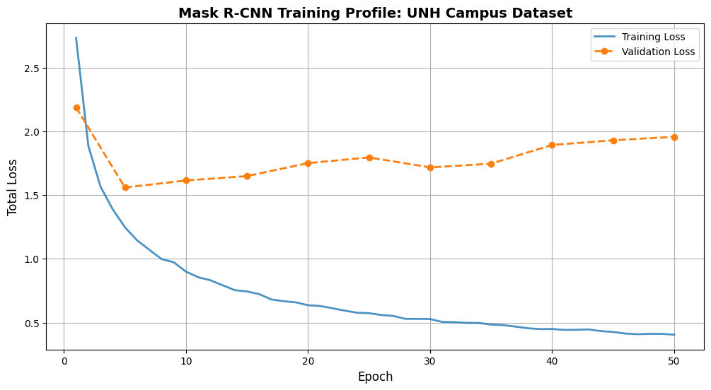
    


[Took 45 mins]


```python
import torch.amp as amp

num_epochs = 10 #running with 10 epochs
val_frequency = 5
device = torch.device('cuda') if torch.cuda.is_available() else torch.device('cpu')

#Best Params from Random Search
best_lr = 0.0017
best_mom = 0.909
best_wd = 0.00002

#initilaizing
model = get_model_instance_segmentation(num_classes=9).to(device)
optimizer = torch.optim.SGD([p for p in model.parameters() if p.requires_grad],
                            lr=best_lr, momentum=best_mom, weight_decay=best_wd)
scaler = amp.GradScaler('cuda')

#save history for plotting
history = {
    "train_loss": [],
    "val_loss": [],
    "pixel_iou": [],
    "instance_iou": [],
    "epochs": []
}

for epoch in range(num_epochs):
    #every epoch calculate training loss
    model.train() #training mode
    epoch_train_loss = 0

    for images, targets in train_loader:
        images = [img.to(device) for img in images]
        targets = [{k: v.to(device) for k, v in t.items()} for t in targets]

        with amp.autocast('cuda'):
            loss_dict = model(images, targets)
            losses = sum(loss for loss in loss_dict.values())

        optimizer.zero_grad()
        scaler.scale(losses).backward()
        scaler.step(optimizer)
        scaler.update()
        epoch_train_loss += losses.item()

    avg_train_loss = epoch_train_loss / len(train_loader)
    history["train_loss"].append(avg_train_loss)
    history["epochs"].append(epoch + 1)

    #validation
    if (epoch + 1) % val_frequency == 0 or epoch == 0:
        #validation loss
        model.train() #train mode
        epoch_val_loss = 0
        with torch.no_grad():
            for images, targets in val_loader:
                images = [img.to(device) for img in images]
                targets = [{k: v.to(device) for k, v in t.items()} for t in targets]

                with amp.autocast('cuda'):
                    val_loss_dict = model(images, targets)
                    val_losses = sum(loss for loss in val_loss_dict.values())
                epoch_val_loss += val_losses.item()

        avg_val_loss = epoch_val_loss / len(val_loader)
        history["val_loss"].append(avg_val_loss)

        #Global Pixel-wise IoU
        p_iou = evaluate_pixel_iou(model, val_loader, device, threshold=0.5)
        history["pixel_iou"].append(p_iou)

        #Instance box IoU
        i_iou = evaluate_strict_iou(model, val_loader, device)
        history["instance_iou"].append(i_iou)

        print(f"Epoch {epoch+1:02d} | T-Loss: {avg_train_loss:.4f} | V-Loss: {avg_val_loss:.4f} | P-IoU: {p_iou:.4f} | I-IoU: {i_iou:.4f}")
    else:
        print(f"   Epoch {epoch+1:02d} | T-Loss: {avg_train_loss:.4f} (Skipping Val)")


print("Training complete.")
```

    Epoch 01 | T-Loss: 2.9894 | V-Loss: 2.2698 | P-IoU: 0.4057 | I-IoU: 0.3842
       Epoch 02 | T-Loss: 2.0377 (Skipping Val)
       Epoch 03 | T-Loss: 1.6922 (Skipping Val)
       Epoch 04 | T-Loss: 1.4827 (Skipping Val)
    Epoch 05 | T-Loss: 1.3285 | V-Loss: 1.5992 | P-IoU: 0.5568 | I-IoU: 0.8079
       Epoch 06 | T-Loss: 1.1992 (Skipping Val)
       Epoch 07 | T-Loss: 1.1247 (Skipping Val)
       Epoch 08 | T-Loss: 1.0440 (Skipping Val)
       Epoch 09 | T-Loss: 0.9946 (Skipping Val)
    Epoch 10 | T-Loss: 0.9632 | V-Loss: 1.5714 | P-IoU: 0.5870 | I-IoU: 0.7627
    Training complete.


```python

val_epochs = [1] + [i for i in range(5, len(history["train_loss"]) + 1, 5)]

plt.figure(figsize=(12, 6))

#training loss
plt.plot(history["epochs"], history["train_loss"], label='Training Loss',
         color='#1f77b4', linewidth=2, alpha=0.8)

#validation loss
plt.plot(val_epochs[:len(history["val_loss"])], history["val_loss"],
         label='Validation Loss', color='#ff7f0e', marker='o', linestyle='--', linewidth=2)

plt.title('Mask R-CNN Training Profile: UNH Campus Dataset - 10 Epochs', fontsize=14, fontweight='bold')
plt.xlabel('Epoch', fontsize=12)
plt.ylabel('Total Loss', fontsize=12)
plt.grid(True, which="both", ls="-")
plt.legend(frameon=True, facecolor='white')

plt.show()
```


    
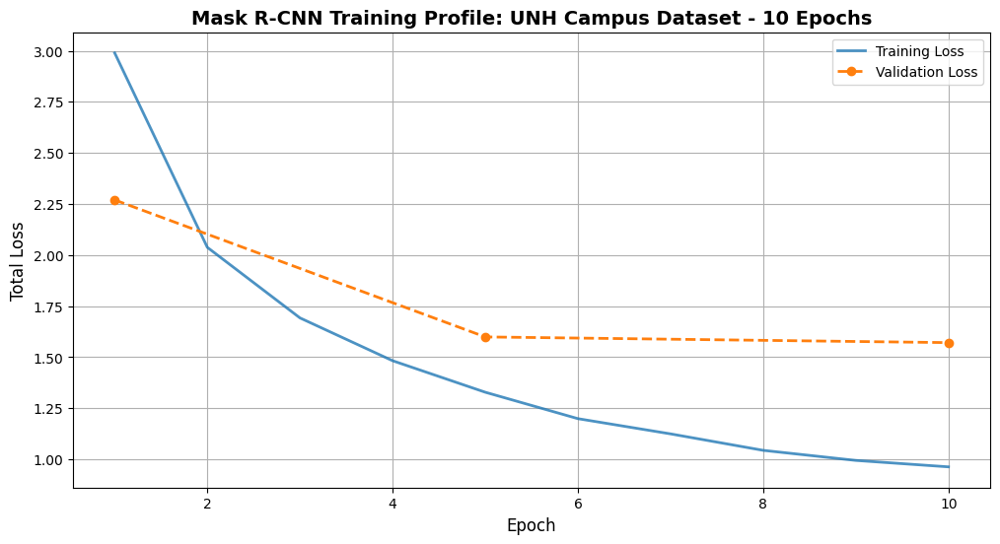
    


```python
checkpoint = {
    'epoch': 10,
    'model_state_dict': model.state_dict(),
    'optimizer_state_dict': optimizer.state_dict(),
    'scaler_state_dict': scaler.state_dict(),
    'history': history
}

torch.save(checkpoint, '/content/drive/MyDrive/deep_learning_project/exp1_checkpoint_10.pth')
```


```python
model = get_model_instance_segmentation(num_classes=9)

checkpoint_path = '/content/drive/MyDrive/deep_learning_project/exp1_checkpoint_10.pth'
checkpoint = torch.load(checkpoint_path, map_location=device)

if isinstance(checkpoint, dict) and 'model_state_dict' in checkpoint:
    model.load_state_dict(checkpoint['model_state_dict'])
    print(f"Loaded Full Checkpoint from Epoch {checkpoint.get('epoch', 'Unknown')}")
else:
    model.load_state_dict(checkpoint)
    print("Loaded Model Weights (State Dict)")

model.to(device)

model.eval()
```

    Loaded Full Checkpoint from Epoch 10


    MaskRCNN(
      (transform): GeneralizedRCNNTransform(
          Normalize(mean=[0.485, 0.456, 0.406], std=[0.229, 0.224, 0.225])
          Resize(min_size=(800,), max_size=1333, mode='bilinear')
      )
      (backbone): BackboneWithFPN(
        (body): IntermediateLayerGetter(
          (conv1): Conv2d(3, 64, kernel_size=(7, 7), stride=(2, 2), padding=(3, 3), bias=False)
          (bn1): FrozenBatchNorm2d(64, eps=0.0)
          (relu): ReLU(inplace=True)
          (maxpool): MaxPool2d(kernel_size=3, stride=2, padding=1, dilation=1, ceil_mode=False)
          (layer1): Sequential(
            (0): Bottleneck(
              (conv1): Conv2d(64, 64, kernel_size=(1, 1), stride=(1, 1), bias=False)
              (bn1): FrozenBatchNorm2d(64, eps=0.0)
              (conv2): Conv2d(64, 64, kernel_size=(3, 3), stride=(1, 1), padding=(1, 1), bias=False)
              (bn2): FrozenBatchNorm2d(64, eps=0.0)
              (conv3): Conv2d(64, 256, kernel_size=(1, 1), stride=(1, 1), bias=False)
              (bn3): FrozenBatchNorm2d(256, eps=0.0)
              (relu): ReLU(inplace=True)
              (downsample): Sequential(
                (0): Conv2d(64, 256, kernel_size=(1, 1), stride=(1, 1), bias=False)
                (1): FrozenBatchNorm2d(256, eps=0.0)
              )
            )
            (1): Bottleneck(
              (conv1): Conv2d(256, 64, kernel_size=(1, 1), stride=(1, 1), bias=False)
              (bn1): FrozenBatchNorm2d(64, eps=0.0)
              (conv2): Conv2d(64, 64, kernel_size=(3, 3), stride=(1, 1), padding=(1, 1), bias=False)
              (bn2): FrozenBatchNorm2d(64, eps=0.0)
              (conv3): Conv2d(64, 256, kernel_size=(1, 1), stride=(1, 1), bias=False)
              (bn3): FrozenBatchNorm2d(256, eps=0.0)
              (relu): ReLU(inplace=True)
            )
            (2): Bottleneck(
              (conv1): Conv2d(256, 64, kernel_size=(1, 1), stride=(1, 1), bias=False)
              (bn1): FrozenBatchNorm2d(64, eps=0.0)
              (conv2): Conv2d(64, 64, kernel_size=(3, 3), stride=(1, 1), padding=(1, 1), bias=False)
              (bn2): FrozenBatchNorm2d(64, eps=0.0)
              (conv3): Conv2d(64, 256, kernel_size=(1, 1), stride=(1, 1), bias=False)
              (bn3): FrozenBatchNorm2d(256, eps=0.0)
              (relu): ReLU(inplace=True)
            )
          )
          (layer2): Sequential(
            (0): Bottleneck(
              (conv1): Conv2d(256, 128, kernel_size=(1, 1), stride=(1, 1), bias=False)
              (bn1): FrozenBatchNorm2d(128, eps=0.0)
              (conv2): Conv2d(128, 128, kernel_size=(3, 3), stride=(2, 2), padding=(1, 1), bias=False)
              (bn2): FrozenBatchNorm2d(128, eps=0.0)
              (conv3): Conv2d(128, 512, kernel_size=(1, 1), stride=(1, 1), bias=False)
              (bn3): FrozenBatchNorm2d(512, eps=0.0)
              (relu): ReLU(inplace=True)
              (downsample): Sequential(
                (0): Conv2d(256, 512, kernel_size=(1, 1), stride=(2, 2), bias=False)
                (1): FrozenBatchNorm2d(512, eps=0.0)
              )
            )
            (1): Bottleneck(
              (conv1): Conv2d(512, 128, kernel_size=(1, 1), stride=(1, 1), bias=False)
              (bn1): FrozenBatchNorm2d(128, eps=0.0)
              (conv2): Conv2d(128, 128, kernel_size=(3, 3), stride=(1, 1), padding=(1, 1), bias=False)
              (bn2): FrozenBatchNorm2d(128, eps=0.0)
              (conv3): Conv2d(128, 512, kernel_size=(1, 1), stride=(1, 1), bias=False)
              (bn3): FrozenBatchNorm2d(512, eps=0.0)
              (relu): ReLU(inplace=True)
            )
            (2): Bottleneck(
              (conv1): Conv2d(512, 128, kernel_size=(1, 1), stride=(1, 1), bias=False)
              (bn1): FrozenBatchNorm2d(128, eps=0.0)
              (conv2): Conv2d(128, 128, kernel_size=(3, 3), stride=(1, 1), padding=(1, 1), bias=False)
              (bn2): FrozenBatchNorm2d(128, eps=0.0)
              (conv3): Conv2d(128, 512, kernel_size=(1, 1), stride=(1, 1), bias=False)
              (bn3): FrozenBatchNorm2d(512, eps=0.0)
              (relu): ReLU(inplace=True)
            )
            (3): Bottleneck(
              (conv1): Conv2d(512, 128, kernel_size=(1, 1), stride=(1, 1), bias=False)
              (bn1): FrozenBatchNorm2d(128, eps=0.0)
              (conv2): Conv2d(128, 128, kernel_size=(3, 3), stride=(1, 1), padding=(1, 1), bias=False)
              (bn2): FrozenBatchNorm2d(128, eps=0.0)
              (conv3): Conv2d(128, 512, kernel_size=(1, 1), stride=(1, 1), bias=False)
              (bn3): FrozenBatchNorm2d(512, eps=0.0)
              (relu): ReLU(inplace=True)
            )
          )
          (layer3): Sequential(
            (0): Bottleneck(
              (conv1): Conv2d(512, 256, kernel_size=(1, 1), stride=(1, 1), bias=False)
              (bn1): FrozenBatchNorm2d(256, eps=0.0)
              (conv2): Conv2d(256, 256, kernel_size=(3, 3), stride=(2, 2), padding=(1, 1), bias=False)
              (bn2): FrozenBatchNorm2d(256, eps=0.0)
              (conv3): Conv2d(256, 1024, kernel_size=(1, 1), stride=(1, 1), bias=False)
              (bn3): FrozenBatchNorm2d(1024, eps=0.0)
              (relu): ReLU(inplace=True)
              (downsample): Sequential(
                (0): Conv2d(512, 1024, kernel_size=(1, 1), stride=(2, 2), bias=False)
                (1): FrozenBatchNorm2d(1024, eps=0.0)
              )
            )
            (1): Bottleneck(
              (conv1): Conv2d(1024, 256, kernel_size=(1, 1), stride=(1, 1), bias=False)
              (bn1): FrozenBatchNorm2d(256, eps=0.0)
              (conv2): Conv2d(256, 256, kernel_size=(3, 3), stride=(1, 1), padding=(1, 1), bias=False)
              (bn2): FrozenBatchNorm2d(256, eps=0.0)
              (conv3): Conv2d(256, 1024, kernel_size=(1, 1), stride=(1, 1), bias=False)
              (bn3): FrozenBatchNorm2d(1024, eps=0.0)
              (relu): ReLU(inplace=True)
            )
            (2): Bottleneck(
              (conv1): Conv2d(1024, 256, kernel_size=(1, 1), stride=(1, 1), bias=False)
              (bn1): FrozenBatchNorm2d(256, eps=0.0)
              (conv2): Conv2d(256, 256, kernel_size=(3, 3), stride=(1, 1), padding=(1, 1), bias=False)
              (bn2): FrozenBatchNorm2d(256, eps=0.0)
              (conv3): Conv2d(256, 1024, kernel_size=(1, 1), stride=(1, 1), bias=False)
              (bn3): FrozenBatchNorm2d(1024, eps=0.0)
              (relu): ReLU(inplace=True)
            )
            (3): Bottleneck(
              (conv1): Conv2d(1024, 256, kernel_size=(1, 1), stride=(1, 1), bias=False)
              (bn1): FrozenBatchNorm2d(256, eps=0.0)
              (conv2): Conv2d(256, 256, kernel_size=(3, 3), stride=(1, 1), padding=(1, 1), bias=False)
              (bn2): FrozenBatchNorm2d(256, eps=0.0)
              (conv3): Conv2d(256, 1024, kernel_size=(1, 1), stride=(1, 1), bias=False)
              (bn3): FrozenBatchNorm2d(1024, eps=0.0)
              (relu): ReLU(inplace=True)
            )
            (4): Bottleneck(
              (conv1): Conv2d(1024, 256, kernel_size=(1, 1), stride=(1, 1), bias=False)
              (bn1): FrozenBatchNorm2d(256, eps=0.0)
              (conv2): Conv2d(256, 256, kernel_size=(3, 3), stride=(1, 1), padding=(1, 1), bias=False)
              (bn2): FrozenBatchNorm2d(256, eps=0.0)
              (conv3): Conv2d(256, 1024, kernel_size=(1, 1), stride=(1, 1), bias=False)
              (bn3): FrozenBatchNorm2d(1024, eps=0.0)
              (relu): ReLU(inplace=True)
            )
            (5): Bottleneck(
              (conv1): Conv2d(1024, 256, kernel_size=(1, 1), stride=(1, 1), bias=False)
              (bn1): FrozenBatchNorm2d(256, eps=0.0)
              (conv2): Conv2d(256, 256, kernel_size=(3, 3), stride=(1, 1), padding=(1, 1), bias=False)
              (bn2): FrozenBatchNorm2d(256, eps=0.0)
              (conv3): Conv2d(256, 1024, kernel_size=(1, 1), stride=(1, 1), bias=False)
              (bn3): FrozenBatchNorm2d(1024, eps=0.0)
              (relu): ReLU(inplace=True)
            )
          )
          (layer4): Sequential(
            (0): Bottleneck(
              (conv1): Conv2d(1024, 512, kernel_size=(1, 1), stride=(1, 1), bias=False)
              (bn1): FrozenBatchNorm2d(512, eps=0.0)
              (conv2): Conv2d(512, 512, kernel_size=(3, 3), stride=(2, 2), padding=(1, 1), bias=False)
              (bn2): FrozenBatchNorm2d(512, eps=0.0)
              (conv3): Conv2d(512, 2048, kernel_size=(1, 1), stride=(1, 1), bias=False)
              (bn3): FrozenBatchNorm2d(2048, eps=0.0)
              (relu): ReLU(inplace=True)
              (downsample): Sequential(
                (0): Conv2d(1024, 2048, kernel_size=(1, 1), stride=(2, 2), bias=False)
                (1): FrozenBatchNorm2d(2048, eps=0.0)
              )
            )
            (1): Bottleneck(
              (conv1): Conv2d(2048, 512, kernel_size=(1, 1), stride=(1, 1), bias=False)
              (bn1): FrozenBatchNorm2d(512, eps=0.0)
              (conv2): Conv2d(512, 512, kernel_size=(3, 3), stride=(1, 1), padding=(1, 1), bias=False)
              (bn2): FrozenBatchNorm2d(512, eps=0.0)
              (conv3): Conv2d(512, 2048, kernel_size=(1, 1), stride=(1, 1), bias=False)
              (bn3): FrozenBatchNorm2d(2048, eps=0.0)
              (relu): ReLU(inplace=True)
            )
            (2): Bottleneck(
              (conv1): Conv2d(2048, 512, kernel_size=(1, 1), stride=(1, 1), bias=False)
              (bn1): FrozenBatchNorm2d(512, eps=0.0)
              (conv2): Conv2d(512, 512, kernel_size=(3, 3), stride=(1, 1), padding=(1, 1), bias=False)
              (bn2): FrozenBatchNorm2d(512, eps=0.0)
              (conv3): Conv2d(512, 2048, kernel_size=(1, 1), stride=(1, 1), bias=False)
              (bn3): FrozenBatchNorm2d(2048, eps=0.0)
              (relu): ReLU(inplace=True)
            )
          )
        )
        (fpn): FeaturePyramidNetwork(
          (inner_blocks): ModuleList(
            (0): Conv2dNormActivation(
              (0): Conv2d(256, 256, kernel_size=(1, 1), stride=(1, 1))
            )
            (1): Conv2dNormActivation(
              (0): Conv2d(512, 256, kernel_size=(1, 1), stride=(1, 1))
            )
            (2): Conv2dNormActivation(
              (0): Conv2d(1024, 256, kernel_size=(1, 1), stride=(1, 1))
            )
            (3): Conv2dNormActivation(
              (0): Conv2d(2048, 256, kernel_size=(1, 1), stride=(1, 1))
            )
          )
          (layer_blocks): ModuleList(
            (0-3): 4 x Conv2dNormActivation(
              (0): Conv2d(256, 256, kernel_size=(3, 3), stride=(1, 1), padding=(1, 1))
            )
          )
          (extra_blocks): LastLevelMaxPool()
        )
      )
      (rpn): RegionProposalNetwork(
        (anchor_generator): AnchorGenerator()
        (head): RPNHead(
          (conv): Sequential(
            (0): Conv2dNormActivation(
              (0): Conv2d(256, 256, kernel_size=(3, 3), stride=(1, 1), padding=(1, 1))
              (1): ReLU(inplace=True)
            )
          )
          (cls_logits): Conv2d(256, 3, kernel_size=(1, 1), stride=(1, 1))
          (bbox_pred): Conv2d(256, 12, kernel_size=(1, 1), stride=(1, 1))
        )
      )
      (roi_heads): RoIHeads(
        (box_roi_pool): MultiScaleRoIAlign(featmap_names=['0', '1', '2', '3'], output_size=(7, 7), sampling_ratio=2)
        (box_head): TwoMLPHead(
          (fc6): Linear(in_features=12544, out_features=1024, bias=True)
          (fc7): Linear(in_features=1024, out_features=1024, bias=True)
        )
        (box_predictor): FastRCNNPredictor(
          (cls_score): Linear(in_features=1024, out_features=9, bias=True)
          (bbox_pred): Linear(in_features=1024, out_features=36, bias=True)
        )
        (mask_roi_pool): MultiScaleRoIAlign(featmap_names=['0', '1', '2', '3'], output_size=(14, 14), sampling_ratio=2)
        (mask_head): MaskRCNNHeads(
          (0): Conv2dNormActivation(
            (0): Conv2d(256, 256, kernel_size=(3, 3), stride=(1, 1), padding=(1, 1))
            (1): ReLU(inplace=True)
          )
          (1): Conv2dNormActivation(
            (0): Conv2d(256, 256, kernel_size=(3, 3), stride=(1, 1), padding=(1, 1))
            (1): ReLU(inplace=True)
          )
          (2): Conv2dNormActivation(
            (0): Conv2d(256, 256, kernel_size=(3, 3), stride=(1, 1), padding=(1, 1))
            (1): ReLU(inplace=True)
          )
          (3): Conv2dNormActivation(
            (0): Conv2d(256, 256, kernel_size=(3, 3), stride=(1, 1), padding=(1, 1))
            (1): ReLU(inplace=True)
          )
        )
        (mask_predictor): MaskRCNNPredictor(
          (conv5_mask): ConvTranspose2d(256, 256, kernel_size=(2, 2), stride=(2, 2))
          (relu): ReLU(inplace=True)
          (mask_fcn_logits): Conv2d(256, 9, kernel_size=(1, 1), stride=(1, 1))
        )
      )
    )


### Performance with Validation Images


```python
unh_classes = {
    1: "Table_Desk", 2: "Chair", 3: "Seated_Student",
    4: "Stationary_Laptop_Tablet", 5: "Stationary_Phone", 6: "Desktop_Active",
    7: "Desktop_Inactive", 8: "Staionary_PersonalItem"
}
```


```python
import numpy as np

def demonstrate_results(model, dataset, index, threshold=0.5, mask_alpha=0.4):
    model.eval()
    img_tensor, target = dataset[index]

    with torch.no_grad():
        prediction = model([img_tensor.to(device)])[0]

    visible_img = denormalize(img_tensor)

    plt.figure(figsize=(15, 10))
    plt.imshow(visible_img)
    ax = plt.gca()

    scores = prediction['scores']
    keep = scores > threshold

    pred_boxes = prediction['boxes'][keep].cpu().numpy()
    pred_labels = prediction['labels'][keep].cpu().numpy()
    pred_scores = scores[keep].cpu().numpy()
    pred_masks = prediction['masks'][keep].cpu().numpy() #[N, 1, H, W]

    colors = ['cyan', 'yellow', 'lime', 'magenta', 'orange', 'white', 'red', 'pink']

    for box, label, score, mask in zip(pred_boxes, pred_labels, pred_scores, pred_masks):
        lbl_id = label.item()
        label_text = unh_classes.get(lbl_id, f"ID:{lbl_id}")
        color = colors[lbl_id % len(colors)]

        mask = mask.squeeze()

        binary_mask = mask > 0.5

        mask_overlay = np.zeros((*binary_mask.shape, 4))

        from matplotlib import colors as mcolors
        rgb = mcolors.to_rgb(color)

        mask_overlay[binary_mask] = [*rgb, mask_alpha]
        ax.imshow(mask_overlay)

        xmin, ymin, xmax, ymax = box
        rect = patches.Rectangle((xmin, ymin), xmax-xmin, ymax-ymin,
                                 linewidth=2, edgecolor=color, facecolor='none')
        ax.add_patch(rect)

        ax.text(xmin, ymin - 5, f"{label_text}: {score:.2f}",
                color='black', fontsize=9, fontweight='bold',
                bbox=dict(facecolor=color, alpha=0.8, pad=1, edgecolor='none'))

    plt.axis('off')
    plt.title(f"Instance Segmentation Results")
    plt.show()

#testing on validation image
demonstrate_results(model, val_dataset, index=5, threshold=0.9)
```


    
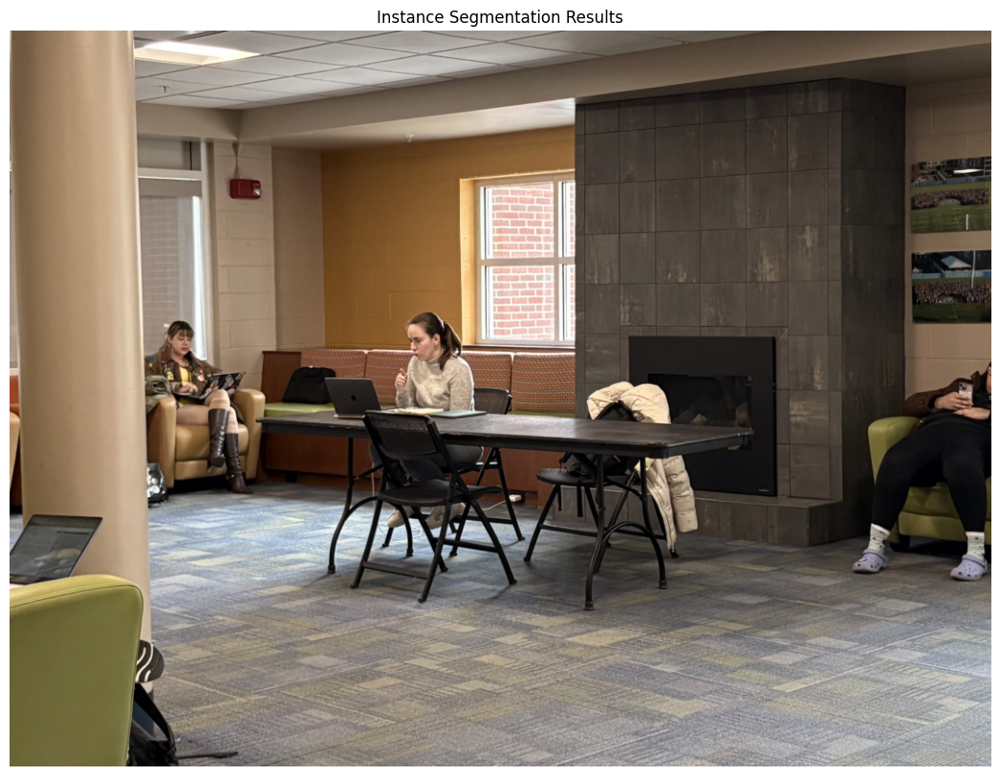
    


```python
demonstrate_results(model, val_dataset, index=2, threshold=0.9)
```


    
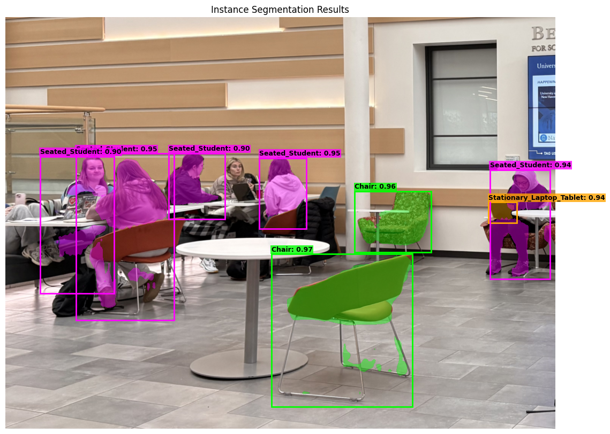
    


```python
demonstrate_results(model, val_dataset, index=3, threshold=0.9)
```


    
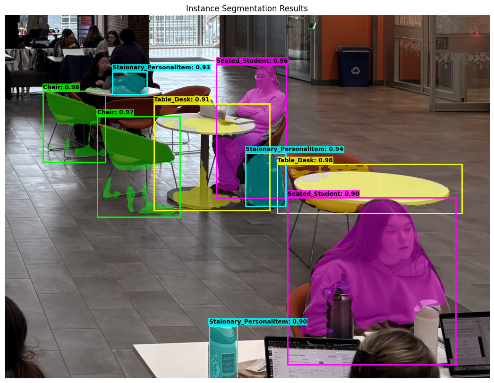
    


```python
demonstrate_results(model, val_dataset, index=4, threshold=0.9)
```


    
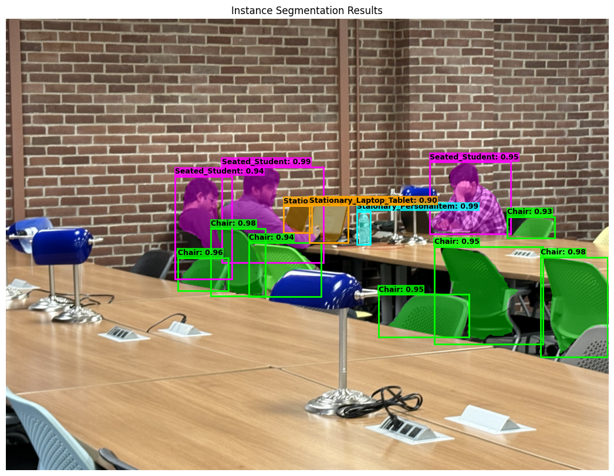
    


### Experiment 2: Adam Weight Decay + MultiStepLR

- instead of SGD, using adam weight decay + multistepLR to see if performance is better.

### Hyperparameter Random Search for AdamW


```python

def run_adamw_trial(trial_id, lr, wd, epochs=5):
    print(f"Trial {trial_id} | AdamW LR: {lr:.2e} | WD: {wd:.2e}")

    #re-instantiate
    model = get_model_instance_segmentation(num_classes=9).to(device)

    #AdamW (betas=0.9, 0.999 is standard)
    optimizer = torch.optim.AdamW([p for p in model.parameters() if p.requires_grad],
                                  lr=lr, weight_decay=wd, betas=(0.9, 0.999))

    scaler = torch.amp.GradScaler('cuda')
    trial_losses = []

    #training Loop (5 epochs only to see)
    for epoch in range(epochs):
        model.train()
        epoch_loss = 0
        for images, targets in train_loader:
            images = [img.to(device) for img in images]
            targets = [{k: v.to(device) for k, v in t.items()} for t in targets]

            with torch.amp.autocast('cuda'):
                loss_dict = model(images, targets)
                losses = sum(loss for loss in loss_dict.values())

            optimizer.zero_grad()
            scaler.scale(losses).backward()
            scaler.step(optimizer)
            scaler.update()
            epoch_loss += losses.item()

        trial_losses.append(epoch_loss / len(train_loader))

    #evaluation (ious and loss)
    i_iou = evaluate_strict_iou(model, val_loader, device)
    p_iou = evaluate_pixel_iou(model, val_loader, device, threshold=0.5)
    avg_loss = sum(trial_losses) / len(trial_losses)

    #ram
    del model, optimizer, scaler
    gc.collect()
    torch.cuda.empty_cache()

    return {"i_iou": i_iou, "p_iou": p_iou, "loss": avg_loss}
```


```python
num_trials = 5 #5 trials
adamw_search_results = []
set_seed(42)

for i in range(1, num_trials + 1):
    #AdamW hyperparam ranges
    #lr: e-5 to 1e-3 (Log Scale)
    lr = 10**random.uniform(-5, -3)

    #wd: 1e-4 to 1e-1 (Log Scale)
    wd = 10**random.uniform(-4, -1)

    metrics = run_adamw_trial(i, lr, wd, epochs=5)

    adamw_search_results.append({
        "Trial": i,
        "LR": lr,
        "WeightDecay": wd,
        "Avg_Loss": metrics["loss"],
        "I_IoU": metrics["i_iou"],
        "P_IoU": metrics["p_iou"],
        "Score": (metrics["i_iou"] + metrics["p_iou"]) - (metrics["loss"] * 0.1)
    })

df_adamw = pd.DataFrame(adamw_search_results).sort_values(by="Score", ascending=False)
print("Top AdamW Hyperparams")
print(df_adamw[['Trial', 'LR', 'WeightDecay', 'Avg_Loss', 'I_IoU', 'P_IoU']].head(5))
```

    Trial 1 | AdamW LR: 1.90e-04 | WD: 1.19e-04
    Trial 2 | AdamW LR: 3.55e-05 | WD: 4.67e-04
    Trial 3 | AdamW LR: 2.97e-04 | WD: 1.07e-02
    Trial 4 | AdamW LR: 6.09e-04 | WD: 1.82e-04
    Trial 5 | AdamW LR: 6.98e-05 | WD: 1.23e-04
    Top AdamW Hyperparams
       Trial        LR  WeightDecay  Avg_Loss     I_IoU     P_IoU
    4      5  0.000070     0.000123  1.751513  0.768362  0.536967
    1      2  0.000035     0.000467  1.958005  0.751412  0.547215
    2      3  0.000297     0.010718  2.012926  0.728814  0.573051
    0      1  0.000190     0.000119  1.752395  0.807910  0.426661
    3      4  0.000609     0.000182  2.468588  0.050847  0.375660


- LR = 0.00007, WD = 0.0001


```python


num_epochs = 50
val_frequency = 5
device = torch.device('cuda') if torch.cuda.is_available() else torch.device('cpu')


adamw_lr = 0.00007 #AdamW optimal LR
adamw_wd = 0.0001 #optimal WD

model = get_model_instance_segmentation(num_classes=9).to(device)

#AdamW instead of SGD
optimizer = torch.optim.AdamW([p for p in model.parameters() if p.requires_grad],
                                lr=adamw_lr,
                                betas=(0.9, 0.999), #standad
                                weight_decay=adamw_wd)

#MultiStepLR
scheduler = MultiStepLR(optimizer, milestones=[30, 45], gamma=0.1)

scaler = amp.GradScaler('cuda')

history_exp2 = {
    "train_loss": [],
    "val_loss": [],
    "pixel_iou": [],
    "instance_iou": [],
    "lr_log": [],
    "epochs": []
}

for epoch in range(num_epochs):
    model.train()
    epoch_train_loss = 0

    current_lr = optimizer.param_groups[0]['lr']
    history_exp2["lr_log"].append(current_lr)

    for images, targets in train_loader:
        images = [img.to(device) for img in images]
        targets = [{k: v.to(device) for k, v in t.items()} for t in targets]

        with amp.autocast('cuda'):
            loss_dict = model(images, targets)
            losses = sum(loss for loss in loss_dict.values())

        optimizer.zero_grad()
        scaler.scale(losses).backward()
        scaler.step(optimizer)
        scaler.update()
        epoch_train_loss += losses.item()

    scheduler.step()

    avg_train_loss = epoch_train_loss / len(train_loader)
    history_exp2["train_loss"].append(avg_train_loss)
    history_exp2["epochs"].append(epoch + 1)

    if (epoch + 1) % val_frequency == 0 or epoch == 0:
        model.train()
        epoch_val_loss = 0
        with torch.no_grad():
            for images, targets in val_loader:
                images = [img.to(device) for img in images]
                targets = [{k: v.to(device) for k, v in t.items()} for t in targets]

                with amp.autocast('cuda'):
                    val_loss_dict = model(images, targets)
                    val_losses = sum(loss for loss in val_loss_dict.values())
                epoch_val_loss += val_losses.item()

        avg_val_loss = epoch_val_loss / len(val_loader)
        history_exp2["val_loss"].append(avg_val_loss)

        p_iou = evaluate_pixel_iou(model, val_loader, device, threshold=0.5)
        history_exp2["pixel_iou"].append(p_iou)

        i_iou = evaluate_strict_iou(model, val_loader, device)
        history_exp2["instance_iou"].append(i_iou)

        print(f"Epoch {epoch+1:02d} | LR: {current_lr:.6f} | T-Loss: {avg_train_loss:.4f} | V-Loss: {avg_val_loss:.4f} | P-IoU: {p_iou:.4f} | I-IoU: {i_iou:.4f}")
    else:
        print(f"   Epoch {epoch+1:02d} | LR: {current_lr:.6f} | T-Loss: {avg_train_loss:.4f} (Skipping Val)")


```

    Epoch 01 | LR: 0.000070 | T-Loss: 2.7639 | V-Loss: 2.1212 | P-IoU: 0.3947 | I-IoU: 0.5198
       Epoch 02 | LR: 0.000070 | T-Loss: 1.8895 (Skipping Val)
       Epoch 03 | LR: 0.000070 | T-Loss: 1.5590 (Skipping Val)
       Epoch 04 | LR: 0.000070 | T-Loss: 1.3872 (Skipping Val)
    Epoch 05 | LR: 0.000070 | T-Loss: 1.2150 | V-Loss: 1.6817 | P-IoU: 0.5378 | I-IoU: 0.7514
       Epoch 06 | LR: 0.000070 | T-Loss: 1.0760 (Skipping Val)
       Epoch 07 | LR: 0.000070 | T-Loss: 0.9974 (Skipping Val)
       Epoch 08 | LR: 0.000070 | T-Loss: 0.9562 (Skipping Val)
       Epoch 09 | LR: 0.000070 | T-Loss: 0.8847 (Skipping Val)
    Epoch 10 | LR: 0.000070 | T-Loss: 0.8400 | V-Loss: 1.6816 | P-IoU: 0.6431 | I-IoU: 0.7401
       Epoch 11 | LR: 0.000070 | T-Loss: 0.7925 (Skipping Val)
       Epoch 12 | LR: 0.000070 | T-Loss: 0.7452 (Skipping Val)
       Epoch 13 | LR: 0.000070 | T-Loss: 0.7227 (Skipping Val)
       Epoch 14 | LR: 0.000070 | T-Loss: 0.6830 (Skipping Val)
    Epoch 15 | LR: 0.000070 | T-Loss: 0.6610 | V-Loss: 1.6395 | P-IoU: 0.6634 | I-IoU: 0.7627
       Epoch 16 | LR: 0.000070 | T-Loss: 0.6338 (Skipping Val)
       Epoch 17 | LR: 0.000070 | T-Loss: 0.6201 (Skipping Val)
       Epoch 18 | LR: 0.000070 | T-Loss: 0.5890 (Skipping Val)
       Epoch 19 | LR: 0.000070 | T-Loss: 0.5755 (Skipping Val)
    Epoch 20 | LR: 0.000070 | T-Loss: 0.5707 | V-Loss: 1.9585 | P-IoU: 0.6814 | I-IoU: 0.7288
       Epoch 21 | LR: 0.000070 | T-Loss: 0.5420 (Skipping Val)
       Epoch 22 | LR: 0.000070 | T-Loss: 0.5441 (Skipping Val)
       Epoch 23 | LR: 0.000070 | T-Loss: 0.5454 (Skipping Val)
       Epoch 24 | LR: 0.000070 | T-Loss: 0.5270 (Skipping Val)
    Epoch 25 | LR: 0.000070 | T-Loss: 0.5035 | V-Loss: 1.8269 | P-IoU: 0.6864 | I-IoU: 0.7401
       Epoch 26 | LR: 0.000070 | T-Loss: 0.4903 (Skipping Val)
       Epoch 27 | LR: 0.000070 | T-Loss: 0.4895 (Skipping Val)
       Epoch 28 | LR: 0.000070 | T-Loss: 0.4731 (Skipping Val)
       Epoch 29 | LR: 0.000070 | T-Loss: 0.4637 (Skipping Val)
    Epoch 30 | LR: 0.000070 | T-Loss: 0.4634 | V-Loss: 2.0309 | P-IoU: 0.6902 | I-IoU: 0.7175
       Epoch 31 | LR: 0.000007 | T-Loss: 0.4268 (Skipping Val)
       Epoch 32 | LR: 0.000007 | T-Loss: 0.3885 (Skipping Val)
       Epoch 33 | LR: 0.000007 | T-Loss: 0.3770 (Skipping Val)
       Epoch 34 | LR: 0.000007 | T-Loss: 0.3614 (Skipping Val)
    Epoch 35 | LR: 0.000007 | T-Loss: 0.3545 | V-Loss: 1.9141 | P-IoU: 0.7152 | I-IoU: 0.7288
       Epoch 36 | LR: 0.000007 | T-Loss: 0.3457 (Skipping Val)
       Epoch 37 | LR: 0.000007 | T-Loss: 0.3424 (Skipping Val)
       Epoch 38 | LR: 0.000007 | T-Loss: 0.3350 (Skipping Val)
       Epoch 39 | LR: 0.000007 | T-Loss: 0.3325 (Skipping Val)
    Epoch 40 | LR: 0.000007 | T-Loss: 0.3296 | V-Loss: 2.0195 | P-IoU: 0.7156 | I-IoU: 0.7006
       Epoch 41 | LR: 0.000007 | T-Loss: 0.3220 (Skipping Val)


    ---------------------------------------------------------------------------

    KeyboardInterrupt                         Traceback (most recent call last)

    /tmp/ipykernel_2036/172782397.py in <cell line: 0>()
         39     history_exp2["lr_log"].append(current_lr)
         40 
    ---> 41     for images, targets in train_loader:
         42         images = [img.to(device) for img in images]
         43         targets = [{k: v.to(device) for k, v in t.items()} for t in targets]


    /usr/local/lib/python3.12/dist-packages/torch/utils/data/dataloader.py in __next__(self)
        739                 # TODO(https://github.com/pytorch/pytorch/issues/76750)
        740                 self._reset()  # type: ignore[call-arg]
    --> 741             data = self._next_data()
        742             self._num_yielded += 1
        743             if (


    /usr/local/lib/python3.12/dist-packages/torch/utils/data/dataloader.py in _next_data(self)
        799     def _next_data(self):
        800         index = self._next_index()  # may raise StopIteration
    --> 801         data = self._dataset_fetcher.fetch(index)  # may raise StopIteration
        802         if self._pin_memory:
        803             data = _utils.pin_memory.pin_memory(data, self._pin_memory_device)


    /usr/local/lib/python3.12/dist-packages/torch/utils/data/_utils/fetch.py in fetch(self, possibly_batched_index)
         52                 data = self.dataset.__getitems__(possibly_batched_index)
         53             else:
    ---> 54                 data = [self.dataset[idx] for idx in possibly_batched_index]
         55         else:
         56             data = self.dataset[possibly_batched_index]


    /tmp/ipykernel_2036/2366770705.py in __getitem__(self, index)
         63 
         64         if self.transforms is not None:
    ---> 65             image, target = self.transforms(image, target)
         66 
         67         return image, target


    /usr/local/lib/python3.12/dist-packages/torch/nn/modules/module.py in _wrapped_call_impl(self, *args, **kwargs)
       1774             return self._compiled_call_impl(*args, **kwargs)  # type: ignore[misc]
       1775         else:
    -> 1776             return self._call_impl(*args, **kwargs)
       1777 
       1778     # torchrec tests the code consistency with the following code


    /usr/local/lib/python3.12/dist-packages/torch/nn/modules/module.py in _call_impl(self, *args, **kwargs)
       1785                 or _global_backward_pre_hooks or _global_backward_hooks
       1786                 or _global_forward_hooks or _global_forward_pre_hooks):
    -> 1787             return forward_call(*args, **kwargs)
       1788 
       1789         result = None


    /usr/local/lib/python3.12/dist-packages/torchvision/transforms/v2/_container.py in forward(self, *inputs)
         50         needs_unpacking = len(inputs) > 1
         51         for transform in self.transforms:
    ---> 52             outputs = transform(*inputs)
         53             inputs = outputs if needs_unpacking else (outputs,)
         54         return outputs


    /usr/local/lib/python3.12/dist-packages/torch/nn/modules/module.py in _wrapped_call_impl(self, *args, **kwargs)
       1774             return self._compiled_call_impl(*args, **kwargs)  # type: ignore[misc]
       1775         else:
    -> 1776             return self._call_impl(*args, **kwargs)
       1777 
       1778     # torchrec tests the code consistency with the following code


    /usr/local/lib/python3.12/dist-packages/torch/nn/modules/module.py in _call_impl(self, *args, **kwargs)
       1785                 or _global_backward_pre_hooks or _global_backward_hooks
       1786                 or _global_forward_hooks or _global_forward_pre_hooks):
    -> 1787             return forward_call(*args, **kwargs)
       1788 
       1789         result = None


    /usr/local/lib/python3.12/dist-packages/torchvision/transforms/v2/_transform.py in forward(self, *inputs)
         67 
         68         flat_outputs = [
    ---> 69             self.transform(inpt, params) if needs_transform else inpt
         70             for (inpt, needs_transform) in zip(flat_inputs, needs_transform_list)
         71         ]


    /usr/local/lib/python3.12/dist-packages/torchvision/transforms/v2/_color.py in transform(self, inpt, params)
        164                 output = self._call_kernel(F.adjust_brightness, output, brightness_factor=brightness_factor)
        165             elif fn_id == 1 and contrast_factor is not None:
    --> 166                 output = self._call_kernel(F.adjust_contrast, output, contrast_factor=contrast_factor)
        167             elif fn_id == 2 and saturation_factor is not None:
        168                 output = self._call_kernel(F.adjust_saturation, output, saturation_factor=saturation_factor)


    /usr/local/lib/python3.12/dist-packages/torchvision/transforms/v2/_transform.py in _call_kernel(self, functional, inpt, *args, **kwargs)
         47     def _call_kernel(self, functional: Callable, inpt: Any, *args: Any, **kwargs: Any) -> Any:
         48         kernel = _get_kernel(functional, type(inpt), allow_passthrough=True)
    ---> 49         return kernel(inpt, *args, **kwargs)
         50 
         51     def transform(self, inpt: Any, params: dict[str, Any]) -> Any:


    /usr/local/lib/python3.12/dist-packages/torchvision/transforms/v2/functional/_utils.py in wrapper(inpt, *args, **kwargs)
         30         # lost after the first operation due to our own __torch_function__
         31         # logic.
    ---> 32         output = kernel(inpt.as_subclass(torch.Tensor), *args, **kwargs)
         33         return tv_tensors.wrap(output, like=inpt)
         34 


    /usr/local/lib/python3.12/dist-packages/torchvision/transforms/v2/functional/_color.py in adjust_contrast_image(image, contrast_factor)
        197     fp = image.is_floating_point()
        198     if c == 3:
    --> 199         grayscale_image = _rgb_to_grayscale_image(image, num_output_channels=1, preserve_dtype=False)
        200         if not fp:
        201             grayscale_image = grayscale_image.floor_()


    /usr/local/lib/python3.12/dist-packages/torchvision/transforms/v2/functional/_color.py in _rgb_to_grayscale_image(image, num_output_channels, preserve_dtype)
         40         return image.repeat(s)
         41     r, g, b = image.unbind(dim=-3)
    ---> 42     l_img = r.mul(0.2989).add_(g, alpha=0.587).add_(b, alpha=0.114)
         43     l_img = l_img.unsqueeze(dim=-3)
         44     if preserve_dtype:


    KeyboardInterrupt: 


- Epoch 15 had lowest validation error (LR = 0.00007, Training Loss = 0.661, Validation Loss=1.640, P-IoU = 0.663, I-IoU = 0.763) - saving model for visualization

- Experiment 1 (Training Loss = 0.963, Validation Loss = 1.571, P-IoU 0.587, I-IoU = 0.763)

- Experiment 2 had lower training loss, slightly higher validation loss, better pixelwise IoU.


```python
num_epochs = 10
val_frequency = 5
device = torch.device('cuda') if torch.cuda.is_available() else torch.device('cpu')


adamw_lr = 0.00007 #AdamW optimal LR
adamw_wd = 0.0001 #optimal WD

model = get_model_instance_segmentation(num_classes=9).to(device)

#AdamW instead of SGD
optimizer = torch.optim.AdamW([p for p in model.parameters() if p.requires_grad],
                                lr=adamw_lr,
                                betas=(0.9, 0.999), #standad
                                weight_decay=adamw_wd)


scaler = amp.GradScaler('cuda')

history_exp2 = {
    "train_loss": [],
    "val_loss": [],
    "pixel_iou": [],
    "instance_iou": [],
    "lr_log": [],
    "epochs": []
}

for epoch in range(num_epochs):
    model.train()
    epoch_train_loss = 0

    current_lr = optimizer.param_groups[0]['lr']
    history_exp2["lr_log"].append(current_lr)

    for images, targets in train_loader:
        images = [img.to(device) for img in images]
        targets = [{k: v.to(device) for k, v in t.items()} for t in targets]

        with amp.autocast('cuda'):
            loss_dict = model(images, targets)
            losses = sum(loss for loss in loss_dict.values())

        optimizer.zero_grad()
        scaler.scale(losses).backward()
        scaler.step(optimizer)
        scaler.update()
        epoch_train_loss += losses.item()

    avg_train_loss = epoch_train_loss / len(train_loader)
    history_exp2["train_loss"].append(avg_train_loss)
    history_exp2["epochs"].append(epoch + 1)

    if (epoch + 1) % val_frequency == 0 or epoch == 0:
        model.train()
        epoch_val_loss = 0
        with torch.no_grad():
            for images, targets in val_loader:
                images = [img.to(device) for img in images]
                targets = [{k: v.to(device) for k, v in t.items()} for t in targets]

                with amp.autocast('cuda'):
                    val_loss_dict = model(images, targets)
                    val_losses = sum(loss for loss in val_loss_dict.values())
                epoch_val_loss += val_losses.item()

        avg_val_loss = epoch_val_loss / len(val_loader)
        history_exp2["val_loss"].append(avg_val_loss)

        p_iou = evaluate_pixel_iou(model, val_loader, device, threshold=0.5)
        history_exp2["pixel_iou"].append(p_iou)

        i_iou = evaluate_strict_iou(model, val_loader, device)
        history_exp2["instance_iou"].append(i_iou)

        print(f"Epoch {epoch+1:02d} | LR: {current_lr:.6f} | T-Loss: {avg_train_loss:.4f} | V-Loss: {avg_val_loss:.4f} | P-IoU: {p_iou:.4f} | I-IoU: {i_iou:.4f}")
    else:
        print(f"   Epoch {epoch+1:02d} | LR: {current_lr:.6f} | T-Loss: {avg_train_loss:.4f} (Skipping Val)")

```

    Epoch 01 | LR: 0.000070 | T-Loss: 2.8236 | V-Loss: 2.2305 | P-IoU: 0.4394 | I-IoU: 0.4520
       Epoch 02 | LR: 0.000070 | T-Loss: 1.9493 (Skipping Val)
       Epoch 03 | LR: 0.000070 | T-Loss: 1.5775 (Skipping Val)
       Epoch 04 | LR: 0.000070 | T-Loss: 1.3933 (Skipping Val)
    Epoch 05 | LR: 0.000070 | T-Loss: 1.2035 | V-Loss: 1.6336 | P-IoU: 0.5519 | I-IoU: 0.7797
       Epoch 06 | LR: 0.000070 | T-Loss: 1.0945 (Skipping Val)
       Epoch 07 | LR: 0.000070 | T-Loss: 1.0080 (Skipping Val)
       Epoch 08 | LR: 0.000070 | T-Loss: 0.9519 (Skipping Val)
       Epoch 09 | LR: 0.000070 | T-Loss: 0.9224 (Skipping Val)
    Epoch 10 | LR: 0.000070 | T-Loss: 0.8369 | V-Loss: 1.6300 | P-IoU: 0.6255 | I-IoU: 0.7740
       Epoch 11 | LR: 0.000070 | T-Loss: 0.7967 (Skipping Val)
       Epoch 12 | LR: 0.000070 | T-Loss: 0.7602 (Skipping Val)
       Epoch 13 | LR: 0.000070 | T-Loss: 0.7185 (Skipping Val)
       Epoch 14 | LR: 0.000070 | T-Loss: 0.6956 (Skipping Val)
    Epoch 15 | LR: 0.000070 | T-Loss: 0.6737 | V-Loss: 1.6811 | P-IoU: 0.6311 | I-IoU: 0.7853


```python
checkpoint = {
    'epoch': 15,
    'model_state_dict': model.state_dict(),
    'optimizer_state_dict': optimizer.state_dict(),
    'scheduler_state_dict': scheduler.state_dict(),
    'scaler_state_dict': scaler.state_dict(),
    'history': history
}

torch.save(checkpoint, '/content/drive/MyDrive/deep_learning_project/exp2_checkpoint_15.pth')

```


```python
val_epochs = [1] + [i for i in range(5, len(history_exp2["train_loss"]) + 1, 5)]

plt.figure(figsize=(12, 6))

#training loss
plt.plot(history_exp2["epochs"], history_exp2["train_loss"], label='Training Loss',
         color='#1f77b4', linewidth=2, alpha=0.8)

#validation loss
plt.plot(val_epochs[:len(history_exp2["val_loss"])], history_exp2["val_loss"],
         label='Validation Loss', color='#ff7f0e', marker='o', linestyle='--', linewidth=2)

plt.title('Exp2: Mask R-CNN Training Profile: UNH Campus Dataset - 15 Epochs', fontsize=14, fontweight='bold')
plt.xlabel('Epoch', fontsize=12)
plt.ylabel('Total Loss', fontsize=12)
plt.grid(True, which="both", ls="-")
plt.legend(frameon=True, facecolor='white')

plt.show()
```


    
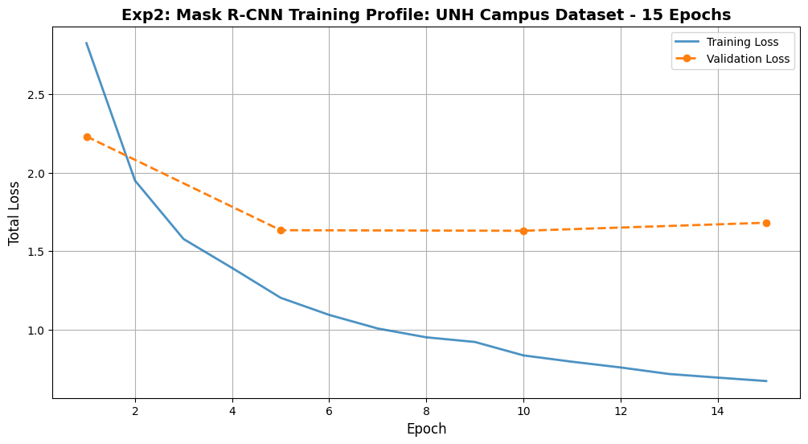
    


```python
demonstrate_results(model, val_dataset, index=3, threshold=0.9)
```


    
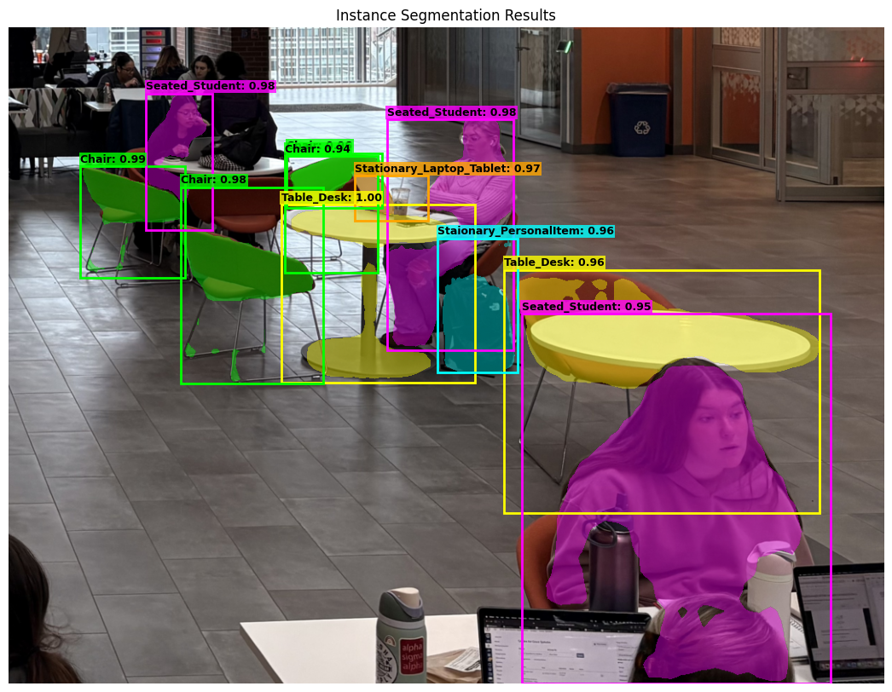
    


```python
demonstrate_results(model, val_dataset, index=4, threshold=0.9)
```


    
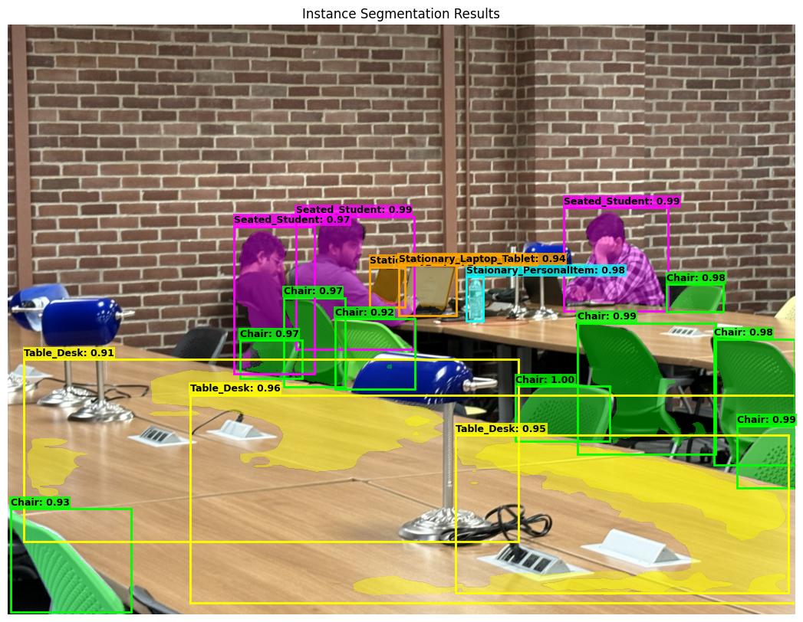
    


```python
demonstrate_results(model, val_dataset, index=5, threshold=0.9)
```


    
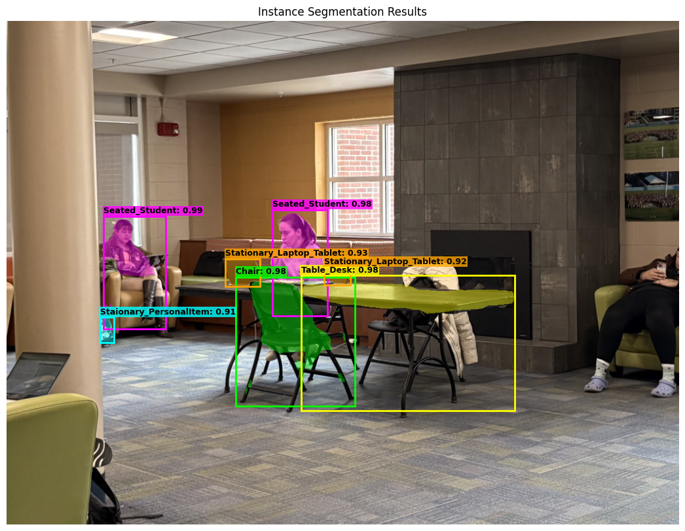
    


- Qualitatively, it looks like it performed better at identifying some items that the previous model did not identify.

### Exp 3: Random Erasing + AdamWD
- AdamWD seemed to perform better when verified looking at the predicted masks on images.
- To try to improve the model further, I will try Random Erasing + Label Smoothing


```python
train_transform = v2.Compose([
    v2.ToImage(),
    v2.RandomHorizontalFlip(p=0.5),
    v2.ColorJitter(brightness=0.3, contrast=0.3, saturation=0.3),
    v2.RandomShortestSize(min_size=list(range(800, 1025)), max_size=1333),

    v2.ToDtype(torch.float32, scale=True),
    v2.RandomErasing(p=0.5, scale=(0.02, 0.1), ratio=(0.3, 3.3), value=0), #ADDING RANDOM ERASING
    v2.Normalize(mean=[0.485, 0.456, 0.406], std=[0.229, 0.224, 0.225])
])

val_test_transform = v2.Compose([
    v2.ToImage(),
    v2.Resize(size=800), #scaling to 800 for validation to maintain aspect ratio
    v2.ToDtype(torch.float32, scale=True),
    v2.Normalize(mean=[0.485, 0.456, 0.406], std=[0.229, 0.224, 0.225])
])
```


```python
#Training set
train_dataset = FastDataset(
    root_orig='/content/data/train_images',
    annotation_orig='/content/data/train_ann.json',
    target_size=1200,
    transforms=train_transform
)

#Validation - 10 images
val_dataset = FastDataset(
    root_orig='/content/data/val_images',
    annotation_orig='/content/data/val_ann.json',
    target_size=1200,
    transforms=val_test_transform
)

#testing - 10 images
test_dataset = FastDataset(
    root_orig='/content/data/test_images',
    annotation_orig='/content/data/test_ann.json',
    target_size=1200,
    transforms=val_test_transform
)

#train loader with new transformations
train_loader = torch.utils.data.DataLoader(train_dataset,
                                           batch_size=2,
                                           shuffle=True,
                                           collate_fn=collate_fn,
                                           num_workers=0,
                                           worker_init_fn=seed_worker,
                                           pin_memory=True)

#VALIDATION dataloader for validation set
val_loader = torch.utils.data.DataLoader(val_dataset,
                                         batch_size=2,
                                         shuffle=False,
                                         collate_fn=collate_fn,
                                         num_workers=0,
                                         worker_init_fn=seed_worker,
                                         pin_memory=True)

#TESTING dataloader for testing set
test_loader = torch.utils.data.DataLoader(test_dataset,
                                          batch_size=2,
                                          shuffle=False,
                                          collate_fn=collate_fn,
                                          num_workers=0,
                                          worker_init_fn=seed_worker,
                                          pin_memory=True)
```

    loading annotations into memory...
    Done (t=0.24s)
    creating index...
    index created!
    Pre-processing with RLE Safety Check
    loading annotations into memory...
    Done (t=0.04s)
    creating index...
    index created!
    Pre-processing with RLE Safety Check
    loading annotations into memory...
    Done (t=0.02s)
    creating index...
    index created!
    Pre-processing with RLE Safety Check


### Random Search for Optimal Hyperparameters


```python
num_trials = 5 #5 trials
adamw_search_results = []
set_seed(42)

for i in range(1, num_trials + 1):
    #AdamW hyperparam ranges
    #lr: e-5 to 1e-3 (Log Scale)
    lr = 10**random.uniform(-5, -3)

    #wd: 1e-4 to 1e-1 (Log Scale)
    wd = 10**random.uniform(-4, -1)

    metrics = run_adamw_trial(i, lr, wd, epochs=5)

    adamw_search_results.append({
        "Trial": i,
        "LR": lr,
        "WeightDecay": wd,
        "Avg_Loss": metrics["loss"],
        "I_IoU": metrics["i_iou"],
        "P_IoU": metrics["p_iou"],
        "Score": (metrics["i_iou"] + metrics["p_iou"]) - (metrics["loss"] * 0.1)
    })

df_adamw = pd.DataFrame(adamw_search_results).sort_values(by="Score", ascending=False)
print("Top AdamW Hyperparams")
print(df_adamw[['Trial', 'LR', 'WeightDecay', 'Avg_Loss', 'I_IoU', 'P_IoU']].head(5))
```

    Trial 1 | AdamW LR: 1.90e-04 | WD: 1.19e-04


    /usr/local/lib/python3.12/dist-packages/torchvision/transforms/v2/_augment.py:94: UserWarning: RandomErasing() is currently passing through inputs of type tv_tensors.BoundingBoxes. This will likely change in the future.
      warnings.warn(
    /usr/local/lib/python3.12/dist-packages/torchvision/transforms/v2/_augment.py:94: UserWarning: RandomErasing() is currently passing through inputs of type tv_tensors.Mask. This will likely change in the future.
      warnings.warn(


    Trial 2 | AdamW LR: 3.55e-05 | WD: 4.67e-04
    Trial 3 | AdamW LR: 2.97e-04 | WD: 1.07e-02
    Trial 4 | AdamW LR: 6.09e-04 | WD: 1.82e-04
    Trial 5 | AdamW LR: 6.98e-05 | WD: 1.23e-04
    Top AdamW Hyperparams
       Trial        LR  WeightDecay  Avg_Loss     I_IoU     P_IoU
    1      2  0.000035     0.000467  1.891239  0.819209  0.554814
    4      5  0.000070     0.000123  1.848742  0.751412  0.523473
    0      1  0.000190     0.000119  1.900890  0.677966  0.499964
    2      3  0.000297     0.010718  2.161491  0.711864  0.433023
    3      4  0.000609     0.000182  2.606118  0.192090  0.391931


```python
num_epochs = 50
val_frequency = 5
device = torch.device('cuda') if torch.cuda.is_available() else torch.device('cpu')


adamw_lr = 0.00004 #AdamLR
adamw_wd = 0.0005 #AdamWD

model = get_model_instance_segmentation(num_classes=9).to(device)

#AdamW instead of SGD
optimizer = torch.optim.AdamW([p for p in model.parameters() if p.requires_grad],
                                lr=adamw_lr,
                                betas=(0.9, 0.999), #standad
                                weight_decay=adamw_wd)

#MultiStepLR
scheduler = MultiStepLR(optimizer, milestones=[25, 35], gamma=0.1)

scaler = amp.GradScaler('cuda')

history_exp3 = {
    "train_loss": [],
    "val_loss": [],
    "pixel_iou": [],
    "instance_iou": [],
    "lr_log": [],
    "epochs": []
}

for epoch in range(num_epochs):
    model.train()
    epoch_train_loss = 0

    current_lr = optimizer.param_groups[0]['lr']
    history_exp3["lr_log"].append(current_lr)

    for images, targets in train_loader:
        images = [img.to(device) for img in images]
        targets = [{k: v.to(device) for k, v in t.items()} for t in targets]

        with amp.autocast('cuda'):
            loss_dict = model(images, targets)
            losses = sum(loss for loss in loss_dict.values())

        optimizer.zero_grad()
        scaler.scale(losses).backward()
        scaler.step(optimizer)
        scaler.update()
        epoch_train_loss += losses.item()

    scheduler.step()

    avg_train_loss = epoch_train_loss / len(train_loader)
    history_exp3["train_loss"].append(avg_train_loss)
    history_exp3["epochs"].append(epoch + 1)

    if (epoch + 1) % val_frequency == 0 or epoch == 0:
        model.train()
        epoch_val_loss = 0
        with torch.no_grad():
            for images, targets in val_loader:
                images = [img.to(device) for img in images]
                targets = [{k: v.to(device) for k, v in t.items()} for t in targets]

                with amp.autocast('cuda'):
                    val_loss_dict = model(images, targets)
                    val_losses = sum(loss for loss in val_loss_dict.values())
                epoch_val_loss += val_losses.item()

        avg_val_loss = epoch_val_loss / len(val_loader)
        history_exp3["val_loss"].append(avg_val_loss)

        p_iou = evaluate_pixel_iou(model, val_loader, device, threshold=0.5)
        history_exp3["pixel_iou"].append(p_iou)

        i_iou = evaluate_strict_iou(model, val_loader, device)
        history_exp3["instance_iou"].append(i_iou)

        print(f"Epoch {epoch+1:02d} | LR: {current_lr:.6f} | T-Loss: {avg_train_loss:.4f} | V-Loss: {avg_val_loss:.4f} | P-IoU: {p_iou:.4f} | I-IoU: {i_iou:.4f}")
    else:
        print(f"   Epoch {epoch+1:02d} | LR: {current_lr:.6f} | T-Loss: {avg_train_loss:.4f} (Skipping Val)")
```

    /usr/local/lib/python3.12/dist-packages/torchvision/transforms/v2/_augment.py:94: UserWarning: RandomErasing() is currently passing through inputs of type tv_tensors.BoundingBoxes. This will likely change in the future.
      warnings.warn(
    /usr/local/lib/python3.12/dist-packages/torchvision/transforms/v2/_augment.py:94: UserWarning: RandomErasing() is currently passing through inputs of type tv_tensors.Mask. This will likely change in the future.
      warnings.warn(


    Epoch 01 | LR: 0.000040 | T-Loss: 2.9883 | V-Loss: 2.3841 | P-IoU: 0.3349 | I-IoU: 0.2090
       Epoch 02 | LR: 0.000040 | T-Loss: 2.1766 (Skipping Val)
       Epoch 03 | LR: 0.000040 | T-Loss: 1.8362 (Skipping Val)
       Epoch 04 | LR: 0.000040 | T-Loss: 1.6233 (Skipping Val)
    Epoch 05 | LR: 0.000040 | T-Loss: 1.4161 | V-Loss: 1.6981 | P-IoU: 0.5422 | I-IoU: 0.7401
       Epoch 06 | LR: 0.000040 | T-Loss: 1.3218 (Skipping Val)
       Epoch 07 | LR: 0.000040 | T-Loss: 1.1979 (Skipping Val)
       Epoch 08 | LR: 0.000040 | T-Loss: 1.0778 (Skipping Val)
       Epoch 09 | LR: 0.000040 | T-Loss: 1.0838 (Skipping Val)
    Epoch 10 | LR: 0.000040 | T-Loss: 0.9845 | V-Loss: 1.7231 | P-IoU: 0.6110 | I-IoU: 0.7288
       Epoch 11 | LR: 0.000040 | T-Loss: 0.9389 (Skipping Val)
       Epoch 12 | LR: 0.000040 | T-Loss: 0.9239 (Skipping Val)
       Epoch 13 | LR: 0.000040 | T-Loss: 0.8968 (Skipping Val)
       Epoch 14 | LR: 0.000040 | T-Loss: 0.8468 (Skipping Val)
    Epoch 15 | LR: 0.000040 | T-Loss: 0.8135 | V-Loss: 1.7399 | P-IoU: 0.6559 | I-IoU: 0.7514
       Epoch 16 | LR: 0.000040 | T-Loss: 0.7762 (Skipping Val)
       Epoch 17 | LR: 0.000040 | T-Loss: 0.7267 (Skipping Val)
       Epoch 18 | LR: 0.000040 | T-Loss: 0.7521 (Skipping Val)
       Epoch 19 | LR: 0.000040 | T-Loss: 0.7139 (Skipping Val)
    Epoch 20 | LR: 0.000040 | T-Loss: 0.7190 | V-Loss: 1.7203 | P-IoU: 0.6601 | I-IoU: 0.7571
       Epoch 21 | LR: 0.000040 | T-Loss: 0.7074 (Skipping Val)
       Epoch 22 | LR: 0.000040 | T-Loss: 0.6766 (Skipping Val)
       Epoch 23 | LR: 0.000040 | T-Loss: 0.6616 (Skipping Val)
       Epoch 24 | LR: 0.000040 | T-Loss: 0.6512 (Skipping Val)
    Epoch 25 | LR: 0.000040 | T-Loss: 0.6132 | V-Loss: 1.6719 | P-IoU: 0.6256 | I-IoU: 0.7910
       Epoch 26 | LR: 0.000004 | T-Loss: 0.6252 (Skipping Val)
       Epoch 27 | LR: 0.000004 | T-Loss: 0.5745 (Skipping Val)
       Epoch 28 | LR: 0.000004 | T-Loss: 0.5216 (Skipping Val)
       Epoch 29 | LR: 0.000004 | T-Loss: 0.5501 (Skipping Val)
    Epoch 30 | LR: 0.000004 | T-Loss: 0.5308 | V-Loss: 1.7598 | P-IoU: 0.6747 | I-IoU: 0.7740
       Epoch 31 | LR: 0.000004 | T-Loss: 0.5304 (Skipping Val)
       Epoch 32 | LR: 0.000004 | T-Loss: 0.5280 (Skipping Val)
       Epoch 33 | LR: 0.000004 | T-Loss: 0.5258 (Skipping Val)
       Epoch 34 | LR: 0.000004 | T-Loss: 0.5227 (Skipping Val)
    Epoch 35 | LR: 0.000004 | T-Loss: 0.5159 | V-Loss: 1.8222 | P-IoU: 0.6726 | I-IoU: 0.7571
       Epoch 36 | LR: 0.000000 | T-Loss: 0.4965 (Skipping Val)
       Epoch 37 | LR: 0.000000 | T-Loss: 0.5623 (Skipping Val)
       Epoch 38 | LR: 0.000000 | T-Loss: 0.5281 (Skipping Val)
       Epoch 39 | LR: 0.000000 | T-Loss: 0.5084 (Skipping Val)
    Epoch 40 | LR: 0.000000 | T-Loss: 0.5016 | V-Loss: 1.8354 | P-IoU: 0.6695 | I-IoU: 0.7401
       Epoch 41 | LR: 0.000000 | T-Loss: 0.5065 (Skipping Val)
       Epoch 42 | LR: 0.000000 | T-Loss: 0.4947 (Skipping Val)
       Epoch 43 | LR: 0.000000 | T-Loss: 0.5248 (Skipping Val)
       Epoch 44 | LR: 0.000000 | T-Loss: 0.4875 (Skipping Val)
    Epoch 45 | LR: 0.000000 | T-Loss: 0.4806 | V-Loss: 1.8264 | P-IoU: 0.6732 | I-IoU: 0.7401
       Epoch 46 | LR: 0.000000 | T-Loss: 0.4865 (Skipping Val)
       Epoch 47 | LR: 0.000000 | T-Loss: 0.5051 (Skipping Val)
       Epoch 48 | LR: 0.000000 | T-Loss: 0.4894 (Skipping Val)


```python
checkpoint = {
    'epoch': 48,
    'model_state_dict': model.state_dict(),
    'optimizer_state_dict': optimizer.state_dict(),
    'scheduler_state_dict': scheduler.state_dict(),
    'scaler_state_dict': scaler.state_dict(),
    'history': history
}

torch.save(checkpoint, '/content/drive/MyDrive/deep_learning_project/exp3_checkpoint_48.pth')

```


```python
#load checkpoint
checkpoint_path = '/content/drive/MyDrive/deep_learning_project/exp3_checkpoint_48.pth'
checkpoint = torch.load(checkpoint_path, map_location=device)

#weight and history
if isinstance(checkpoint, dict):
    #w
    if 'model_state_dict' in checkpoint:
        model.load_state_dict(checkpoint['model_state_dict'])

    #history (epochs)
    if 'history' in checkpoint:
        history = checkpoint['history']
else:
    model.load_state_dict(checkpoint)
    print("Loaded Model")

model.to(device)
model.eval()

```


    MaskRCNN(
      (transform): GeneralizedRCNNTransform(
          Normalize(mean=[0.485, 0.456, 0.406], std=[0.229, 0.224, 0.225])
          Resize(min_size=(800,), max_size=1333, mode='bilinear')
      )
      (backbone): BackboneWithFPN(
        (body): IntermediateLayerGetter(
          (conv1): Conv2d(3, 64, kernel_size=(7, 7), stride=(2, 2), padding=(3, 3), bias=False)
          (bn1): FrozenBatchNorm2d(64, eps=0.0)
          (relu): ReLU(inplace=True)
          (maxpool): MaxPool2d(kernel_size=3, stride=2, padding=1, dilation=1, ceil_mode=False)
          (layer1): Sequential(
            (0): Bottleneck(
              (conv1): Conv2d(64, 64, kernel_size=(1, 1), stride=(1, 1), bias=False)
              (bn1): FrozenBatchNorm2d(64, eps=0.0)
              (conv2): Conv2d(64, 64, kernel_size=(3, 3), stride=(1, 1), padding=(1, 1), bias=False)
              (bn2): FrozenBatchNorm2d(64, eps=0.0)
              (conv3): Conv2d(64, 256, kernel_size=(1, 1), stride=(1, 1), bias=False)
              (bn3): FrozenBatchNorm2d(256, eps=0.0)
              (relu): ReLU(inplace=True)
              (downsample): Sequential(
                (0): Conv2d(64, 256, kernel_size=(1, 1), stride=(1, 1), bias=False)
                (1): FrozenBatchNorm2d(256, eps=0.0)
              )
            )
            (1): Bottleneck(
              (conv1): Conv2d(256, 64, kernel_size=(1, 1), stride=(1, 1), bias=False)
              (bn1): FrozenBatchNorm2d(64, eps=0.0)
              (conv2): Conv2d(64, 64, kernel_size=(3, 3), stride=(1, 1), padding=(1, 1), bias=False)
              (bn2): FrozenBatchNorm2d(64, eps=0.0)
              (conv3): Conv2d(64, 256, kernel_size=(1, 1), stride=(1, 1), bias=False)
              (bn3): FrozenBatchNorm2d(256, eps=0.0)
              (relu): ReLU(inplace=True)
            )
            (2): Bottleneck(
              (conv1): Conv2d(256, 64, kernel_size=(1, 1), stride=(1, 1), bias=False)
              (bn1): FrozenBatchNorm2d(64, eps=0.0)
              (conv2): Conv2d(64, 64, kernel_size=(3, 3), stride=(1, 1), padding=(1, 1), bias=False)
              (bn2): FrozenBatchNorm2d(64, eps=0.0)
              (conv3): Conv2d(64, 256, kernel_size=(1, 1), stride=(1, 1), bias=False)
              (bn3): FrozenBatchNorm2d(256, eps=0.0)
              (relu): ReLU(inplace=True)
            )
          )
          (layer2): Sequential(
            (0): Bottleneck(
              (conv1): Conv2d(256, 128, kernel_size=(1, 1), stride=(1, 1), bias=False)
              (bn1): FrozenBatchNorm2d(128, eps=0.0)
              (conv2): Conv2d(128, 128, kernel_size=(3, 3), stride=(2, 2), padding=(1, 1), bias=False)
              (bn2): FrozenBatchNorm2d(128, eps=0.0)
              (conv3): Conv2d(128, 512, kernel_size=(1, 1), stride=(1, 1), bias=False)
              (bn3): FrozenBatchNorm2d(512, eps=0.0)
              (relu): ReLU(inplace=True)
              (downsample): Sequential(
                (0): Conv2d(256, 512, kernel_size=(1, 1), stride=(2, 2), bias=False)
                (1): FrozenBatchNorm2d(512, eps=0.0)
              )
            )
            (1): Bottleneck(
              (conv1): Conv2d(512, 128, kernel_size=(1, 1), stride=(1, 1), bias=False)
              (bn1): FrozenBatchNorm2d(128, eps=0.0)
              (conv2): Conv2d(128, 128, kernel_size=(3, 3), stride=(1, 1), padding=(1, 1), bias=False)
              (bn2): FrozenBatchNorm2d(128, eps=0.0)
              (conv3): Conv2d(128, 512, kernel_size=(1, 1), stride=(1, 1), bias=False)
              (bn3): FrozenBatchNorm2d(512, eps=0.0)
              (relu): ReLU(inplace=True)
            )
            (2): Bottleneck(
              (conv1): Conv2d(512, 128, kernel_size=(1, 1), stride=(1, 1), bias=False)
              (bn1): FrozenBatchNorm2d(128, eps=0.0)
              (conv2): Conv2d(128, 128, kernel_size=(3, 3), stride=(1, 1), padding=(1, 1), bias=False)
              (bn2): FrozenBatchNorm2d(128, eps=0.0)
              (conv3): Conv2d(128, 512, kernel_size=(1, 1), stride=(1, 1), bias=False)
              (bn3): FrozenBatchNorm2d(512, eps=0.0)
              (relu): ReLU(inplace=True)
            )
            (3): Bottleneck(
              (conv1): Conv2d(512, 128, kernel_size=(1, 1), stride=(1, 1), bias=False)
              (bn1): FrozenBatchNorm2d(128, eps=0.0)
              (conv2): Conv2d(128, 128, kernel_size=(3, 3), stride=(1, 1), padding=(1, 1), bias=False)
              (bn2): FrozenBatchNorm2d(128, eps=0.0)
              (conv3): Conv2d(128, 512, kernel_size=(1, 1), stride=(1, 1), bias=False)
              (bn3): FrozenBatchNorm2d(512, eps=0.0)
              (relu): ReLU(inplace=True)
            )
          )
          (layer3): Sequential(
            (0): Bottleneck(
              (conv1): Conv2d(512, 256, kernel_size=(1, 1), stride=(1, 1), bias=False)
              (bn1): FrozenBatchNorm2d(256, eps=0.0)
              (conv2): Conv2d(256, 256, kernel_size=(3, 3), stride=(2, 2), padding=(1, 1), bias=False)
              (bn2): FrozenBatchNorm2d(256, eps=0.0)
              (conv3): Conv2d(256, 1024, kernel_size=(1, 1), stride=(1, 1), bias=False)
              (bn3): FrozenBatchNorm2d(1024, eps=0.0)
              (relu): ReLU(inplace=True)
              (downsample): Sequential(
                (0): Conv2d(512, 1024, kernel_size=(1, 1), stride=(2, 2), bias=False)
                (1): FrozenBatchNorm2d(1024, eps=0.0)
              )
            )
            (1): Bottleneck(
              (conv1): Conv2d(1024, 256, kernel_size=(1, 1), stride=(1, 1), bias=False)
              (bn1): FrozenBatchNorm2d(256, eps=0.0)
              (conv2): Conv2d(256, 256, kernel_size=(3, 3), stride=(1, 1), padding=(1, 1), bias=False)
              (bn2): FrozenBatchNorm2d(256, eps=0.0)
              (conv3): Conv2d(256, 1024, kernel_size=(1, 1), stride=(1, 1), bias=False)
              (bn3): FrozenBatchNorm2d(1024, eps=0.0)
              (relu): ReLU(inplace=True)
            )
            (2): Bottleneck(
              (conv1): Conv2d(1024, 256, kernel_size=(1, 1), stride=(1, 1), bias=False)
              (bn1): FrozenBatchNorm2d(256, eps=0.0)
              (conv2): Conv2d(256, 256, kernel_size=(3, 3), stride=(1, 1), padding=(1, 1), bias=False)
              (bn2): FrozenBatchNorm2d(256, eps=0.0)
              (conv3): Conv2d(256, 1024, kernel_size=(1, 1), stride=(1, 1), bias=False)
              (bn3): FrozenBatchNorm2d(1024, eps=0.0)
              (relu): ReLU(inplace=True)
            )
            (3): Bottleneck(
              (conv1): Conv2d(1024, 256, kernel_size=(1, 1), stride=(1, 1), bias=False)
              (bn1): FrozenBatchNorm2d(256, eps=0.0)
              (conv2): Conv2d(256, 256, kernel_size=(3, 3), stride=(1, 1), padding=(1, 1), bias=False)
              (bn2): FrozenBatchNorm2d(256, eps=0.0)
              (conv3): Conv2d(256, 1024, kernel_size=(1, 1), stride=(1, 1), bias=False)
              (bn3): FrozenBatchNorm2d(1024, eps=0.0)
              (relu): ReLU(inplace=True)
            )
            (4): Bottleneck(
              (conv1): Conv2d(1024, 256, kernel_size=(1, 1), stride=(1, 1), bias=False)
              (bn1): FrozenBatchNorm2d(256, eps=0.0)
              (conv2): Conv2d(256, 256, kernel_size=(3, 3), stride=(1, 1), padding=(1, 1), bias=False)
              (bn2): FrozenBatchNorm2d(256, eps=0.0)
              (conv3): Conv2d(256, 1024, kernel_size=(1, 1), stride=(1, 1), bias=False)
              (bn3): FrozenBatchNorm2d(1024, eps=0.0)
              (relu): ReLU(inplace=True)
            )
            (5): Bottleneck(
              (conv1): Conv2d(1024, 256, kernel_size=(1, 1), stride=(1, 1), bias=False)
              (bn1): FrozenBatchNorm2d(256, eps=0.0)
              (conv2): Conv2d(256, 256, kernel_size=(3, 3), stride=(1, 1), padding=(1, 1), bias=False)
              (bn2): FrozenBatchNorm2d(256, eps=0.0)
              (conv3): Conv2d(256, 1024, kernel_size=(1, 1), stride=(1, 1), bias=False)
              (bn3): FrozenBatchNorm2d(1024, eps=0.0)
              (relu): ReLU(inplace=True)
            )
          )
          (layer4): Sequential(
            (0): Bottleneck(
              (conv1): Conv2d(1024, 512, kernel_size=(1, 1), stride=(1, 1), bias=False)
              (bn1): FrozenBatchNorm2d(512, eps=0.0)
              (conv2): Conv2d(512, 512, kernel_size=(3, 3), stride=(2, 2), padding=(1, 1), bias=False)
              (bn2): FrozenBatchNorm2d(512, eps=0.0)
              (conv3): Conv2d(512, 2048, kernel_size=(1, 1), stride=(1, 1), bias=False)
              (bn3): FrozenBatchNorm2d(2048, eps=0.0)
              (relu): ReLU(inplace=True)
              (downsample): Sequential(
                (0): Conv2d(1024, 2048, kernel_size=(1, 1), stride=(2, 2), bias=False)
                (1): FrozenBatchNorm2d(2048, eps=0.0)
              )
            )
            (1): Bottleneck(
              (conv1): Conv2d(2048, 512, kernel_size=(1, 1), stride=(1, 1), bias=False)
              (bn1): FrozenBatchNorm2d(512, eps=0.0)
              (conv2): Conv2d(512, 512, kernel_size=(3, 3), stride=(1, 1), padding=(1, 1), bias=False)
              (bn2): FrozenBatchNorm2d(512, eps=0.0)
              (conv3): Conv2d(512, 2048, kernel_size=(1, 1), stride=(1, 1), bias=False)
              (bn3): FrozenBatchNorm2d(2048, eps=0.0)
              (relu): ReLU(inplace=True)
            )
            (2): Bottleneck(
              (conv1): Conv2d(2048, 512, kernel_size=(1, 1), stride=(1, 1), bias=False)
              (bn1): FrozenBatchNorm2d(512, eps=0.0)
              (conv2): Conv2d(512, 512, kernel_size=(3, 3), stride=(1, 1), padding=(1, 1), bias=False)
              (bn2): FrozenBatchNorm2d(512, eps=0.0)
              (conv3): Conv2d(512, 2048, kernel_size=(1, 1), stride=(1, 1), bias=False)
              (bn3): FrozenBatchNorm2d(2048, eps=0.0)
              (relu): ReLU(inplace=True)
            )
          )
        )
        (fpn): FeaturePyramidNetwork(
          (inner_blocks): ModuleList(
            (0): Conv2dNormActivation(
              (0): Conv2d(256, 256, kernel_size=(1, 1), stride=(1, 1))
            )
            (1): Conv2dNormActivation(
              (0): Conv2d(512, 256, kernel_size=(1, 1), stride=(1, 1))
            )
            (2): Conv2dNormActivation(
              (0): Conv2d(1024, 256, kernel_size=(1, 1), stride=(1, 1))
            )
            (3): Conv2dNormActivation(
              (0): Conv2d(2048, 256, kernel_size=(1, 1), stride=(1, 1))
            )
          )
          (layer_blocks): ModuleList(
            (0-3): 4 x Conv2dNormActivation(
              (0): Conv2d(256, 256, kernel_size=(3, 3), stride=(1, 1), padding=(1, 1))
            )
          )
          (extra_blocks): LastLevelMaxPool()
        )
      )
      (rpn): RegionProposalNetwork(
        (anchor_generator): AnchorGenerator()
        (head): RPNHead(
          (conv): Sequential(
            (0): Conv2dNormActivation(
              (0): Conv2d(256, 256, kernel_size=(3, 3), stride=(1, 1), padding=(1, 1))
              (1): ReLU(inplace=True)
            )
          )
          (cls_logits): Conv2d(256, 3, kernel_size=(1, 1), stride=(1, 1))
          (bbox_pred): Conv2d(256, 12, kernel_size=(1, 1), stride=(1, 1))
        )
      )
      (roi_heads): RoIHeads(
        (box_roi_pool): MultiScaleRoIAlign(featmap_names=['0', '1', '2', '3'], output_size=(7, 7), sampling_ratio=2)
        (box_head): TwoMLPHead(
          (fc6): Linear(in_features=12544, out_features=1024, bias=True)
          (fc7): Linear(in_features=1024, out_features=1024, bias=True)
        )
        (box_predictor): FastRCNNPredictor(
          (cls_score): Linear(in_features=1024, out_features=9, bias=True)
          (bbox_pred): Linear(in_features=1024, out_features=36, bias=True)
        )
        (mask_roi_pool): MultiScaleRoIAlign(featmap_names=['0', '1', '2', '3'], output_size=(14, 14), sampling_ratio=2)
        (mask_head): MaskRCNNHeads(
          (0): Conv2dNormActivation(
            (0): Conv2d(256, 256, kernel_size=(3, 3), stride=(1, 1), padding=(1, 1))
            (1): ReLU(inplace=True)
          )
          (1): Conv2dNormActivation(
            (0): Conv2d(256, 256, kernel_size=(3, 3), stride=(1, 1), padding=(1, 1))
            (1): ReLU(inplace=True)
          )
          (2): Conv2dNormActivation(
            (0): Conv2d(256, 256, kernel_size=(3, 3), stride=(1, 1), padding=(1, 1))
            (1): ReLU(inplace=True)
          )
          (3): Conv2dNormActivation(
            (0): Conv2d(256, 256, kernel_size=(3, 3), stride=(1, 1), padding=(1, 1))
            (1): ReLU(inplace=True)
          )
        )
        (mask_predictor): MaskRCNNPredictor(
          (conv5_mask): ConvTranspose2d(256, 256, kernel_size=(2, 2), stride=(2, 2))
          (relu): ReLU(inplace=True)
          (mask_fcn_logits): Conv2d(256, 9, kernel_size=(1, 1), stride=(1, 1))
        )
      )
    )


```python
val_epochs = [1] + [i for i in range(5, len(history["train_loss"]) + 1, 5)]

plt.figure(figsize=(12, 6))

#training loss
plt.plot(history["epochs"], history["train_loss"], label='Training Loss',
         color='#1f77b4', linewidth=2, alpha=0.8)

#validation loss
plt.plot(val_epochs[:len(history["val_loss"])], history["val_loss"],
         label='Validation Loss', color='#ff7f0e', marker='o', linestyle='--', linewidth=2)

plt.title('Exp3: Mask R-CNN Training Profile: UNH Campus Dataset - 15 Epochs', fontsize=14, fontweight='bold')
plt.xlabel('Epoch', fontsize=12)
plt.ylabel('Total Loss', fontsize=12)
plt.grid(True, which="both", ls="-")
plt.legend(frameon=True, facecolor='white')

plt.show()
```


    
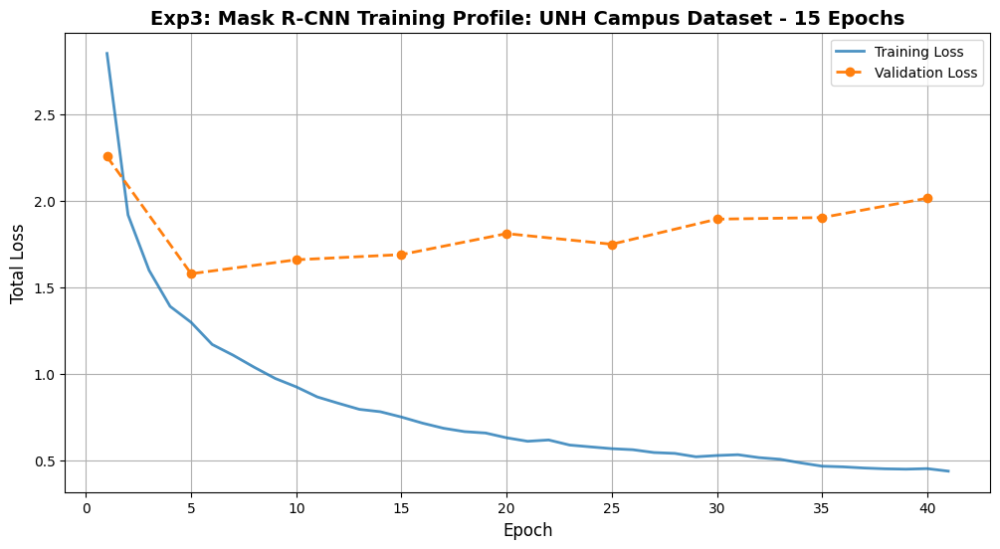
    


```python
demonstrate_results(model, val_dataset, index=3, threshold=0.5)
```


    
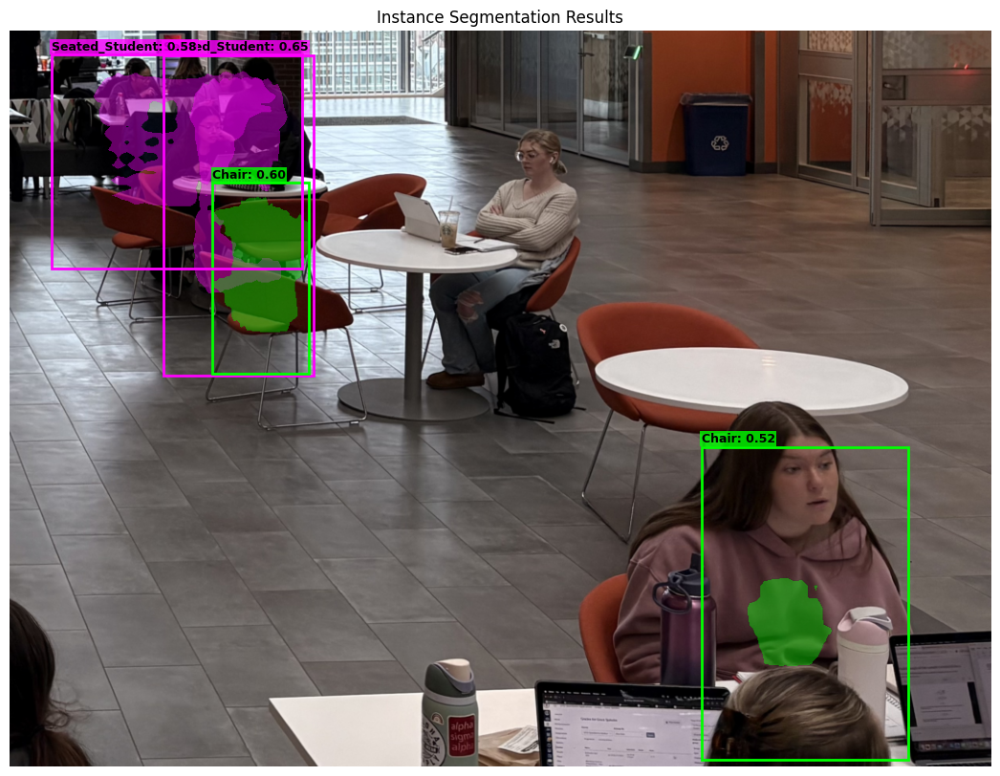
    


### 10 Epoch Experiment 1 on Test Data


```python
device = torch.device('cuda') if torch.cuda.is_available() else torch.device('cpu')
threshold = 0.5

model = get_model_instance_segmentation(num_classes=9)

checkpoint_path = '/content/drive/MyDrive/deep_learning_project/exp1_checkpoint_10.pth'
checkpoint = torch.load(checkpoint_path, map_location=device)

if isinstance(checkpoint, dict) and 'model_state_dict' in checkpoint:
    model.load_state_dict(checkpoint['model_state_dict'])
else:
    model.load_state_dict(checkpoint)

model.to(device)

model.train() #just for loss calulation in TEST set
test_total_loss = 0.0
sub_losses = {'loss_classifier': 0, 'loss_box_reg': 0, 'loss_mask': 0, 'loss_objectness': 0, 'loss_rpn_box_reg': 0}

with torch.no_grad():
    for images, targets in test_loader:
        images = [img.to(device) for img in images]
        targets = [{k: v.to(device) for k, v in t.items()} for t in targets]

        #train mode for losses
        with torch.amp.autocast('cuda'):
            loss_dict = model(images, targets)

            for k, v in loss_dict.items():
                sub_losses[k] += v.item()

            test_total_loss += sum(loss for loss in loss_dict.values()).item()

num_batches = len(test_loader)
avg_test_loss = test_total_loss / num_batches
avg_sub_losses = {k: v / num_batches for k, v in sub_losses.items()}

#back to eval mode for IoU
model.eval()
final_i_iou = evaluate_strict_iou(model, test_loader, device)
final_p_iou = evaluate_pixel_iou(model, test_loader, device, threshold=0.5)

print(f"Total Test Loss:    {avg_test_loss:.4f}")
print(f"Instance IoU (Box): {final_i_iou:.4f}")
print(f"Pixel IoU (Mask):   {final_p_iou:.4f}")
print("Loss:")
for k, v in avg_sub_losses.items():
    print(f"  - {k:18}: {v:.4f}")

```

    Downloading: "https://download.pytorch.org/models/maskrcnn_resnet50_fpn_coco-bf2d0c1e.pth" to /root/.cache/torch/hub/checkpoints/maskrcnn_resnet50_fpn_coco-bf2d0c1e.pth


    100%|██████████| 170M/170M [00:00<00:00, 226MB/s]


    Total Test Loss:    1.7759
    Instance IoU (Box): 0.7744
    Pixel IoU (Mask):   0.5848
    Loss:
      - loss_classifier   : 0.4967
      - loss_box_reg      : 0.5218
      - loss_mask         : 0.3042
      - loss_objectness   : 0.3363
      - loss_rpn_box_reg  : 0.1168


-Instance IoU (Box) Suggests that the ground truth boxes and predicted boxes overlap 77% of the time!

- Pixelwise IoU Suggests that pixel-wise overlap is lower, at 58.5% of the time.


```python
import math

def visualize_test_results(model, dataset, num_images=10, threshold=0.75):
    model.eval()
    cols = 2
    rows = math.ceil(num_images / cols)

    fig, axes = plt.subplots(rows, cols, figsize=(20, rows * 8))
    axes = axes.flatten()

    colors = ['cyan', 'yellow', 'lime', 'magenta', 'orange', 'white', 'red', 'pink']

    for i in range(num_images):
        img_tensor, target = dataset[i]

        with torch.no_grad():
            prediction = model([img_tensor.to(device)])[0]

        visible_img = denormalize(img_tensor)
        axes[i].imshow(visible_img)

        keep = prediction['scores'] > threshold

        p_boxes = prediction['boxes'][keep].cpu().numpy()
        p_labels = prediction['labels'][keep].cpu().numpy()
        p_masks = prediction['masks'][keep].cpu().numpy()
        p_scores = prediction['scores'][keep].cpu().numpy()

        for box, label, mask, score in zip(p_boxes, p_labels, p_masks, p_scores):
            lbl_id = label.item()
            color = colors[lbl_id % len(colors)]
            label_text = unh_classes.get(lbl_id, f"ID:{lbl_id}")

            mask = mask.squeeze()
            binary_mask = mask > 0.5
            from matplotlib import colors as mcolors
            rgb = mcolors.to_rgb(color)
            mask_overlay = np.zeros((*binary_mask.shape, 4))
            mask_overlay[binary_mask] = [*rgb, 0.4]
            axes[i].imshow(mask_overlay)

            xmin, ymin, xmax, ymax = box
            rect = patches.Rectangle((xmin, ymin), xmax-xmin, ymax-ymin,
                                     linewidth=2, edgecolor=color, facecolor='none')
            axes[i].add_patch(rect)

            axes[i].text(xmin, ymin - 5, f"{label_text}: {score:.2f}",
                        color='black', fontsize=9, fontweight='bold',
                        bbox=dict(facecolor=color, alpha=0.8, pad=1, edgecolor='none'))

        axes[i].set_title(f"Test Image ID: {i} | Confident Objects: {len(p_boxes)}", fontsize=12)
        axes[i].axis('off')

    plt.tight_layout()
    plt.suptitle(f"Final Test Evaluation: Experiment 1 (Best Model)", fontsize=22, y=1.02)
    plt.show()

# Run it on your test dataset
visualize_test_results(model, test_dataset, num_images=10, threshold=0.75)
```


    

    


### Comparative performance (between calss objects)


```python
import torch
import torchvision
import numpy as np
from collections import defaultdict

def print_performance_summary(model, dataset, device, threshold=0.5):
    model.eval()
    stats = defaultdict(lambda: {'conf': [], 'box': [], 'mask': []})

    for img_tensor, target in dataset:
        with torch.no_grad():
            prediction = model([img_tensor.to(device)])[0]

        gt_boxes = target['boxes'].to(device)
        gt_masks = target['masks'].to(device)
        gt_labels = target['labels'].to(device)

        #only want to keep above 50% confidence
        keep = prediction['scores'] > threshold
        p_boxes = prediction['boxes'][keep]
        p_masks = prediction['masks'][keep]
        p_labels = prediction['labels'][keep]
        p_scores = prediction['scores'][keep]

        if len(p_boxes) == 0 or len(gt_boxes) == 0:
            continue

        #from PyTorch IoU
        iou_matrix = torchvision.ops.box_iou(p_boxes, gt_boxes)

        for p_idx in range(len(p_boxes)):
            p_label = p_labels[p_idx].item()

            matching_gt_indices = (gt_labels == p_label).nonzero(as_tuple=True)[0]

            if len(matching_gt_indices) == 0:
                continue

            matching_ious = iou_matrix[p_idx, matching_gt_indices]

            best_iou, best_match_local_idx = torch.max(matching_ious, dim=0)
            best_gt_idx = matching_gt_indices[best_match_local_idx]

            if best_iou > 0:
                #mask IoU
                p_m = p_masks[p_idx].squeeze() > 0.5
                gt_m = gt_masks[best_gt_idx].squeeze() > 0.5

                intersection = torch.logical_and(p_m, gt_m).sum().item()
                union = torch.logical_or(p_m, gt_m).sum().item()
                mask_iou = intersection / union if union > 0 else 0

                stats[p_label]['conf'].append(p_scores[p_idx].item())
                stats[p_label]['box'].append(best_iou.item())
                stats[p_label]['mask'].append(mask_iou)

    #formatted printing
    print(f"{'Class':<15} | {'Avg Conf':<10} | {'Box IoU':<8} | {'Mask IoU':<8}")
    for label_id, data in stats.items():
        name = unh_classes.get(label_id, f"ID:{label_id}")
        if data['conf']:
            print(f"{name:<15} | {np.mean(data['conf']):.4f}   | {np.mean(data['box']):.4f} | {np.mean(data['mask']):.4f}")

print_performance_summary(model, test_dataset, device)
```

    Class           | Avg Conf   | Box IoU  | Mask IoU
    Chair           | 0.8616   | 0.7087 | 0.6386
    Table_Desk      | 0.7279   | 0.3874 | 0.3325
    Staionary_PersonalItem | 0.8142   | 0.5726 | 0.6789
    Seated_Student  | 0.8463   | 0.6921 | 0.6815
    Stationary_Laptop_Tablet | 0.6912   | 0.5762 | 0.5737
    Desktop_Inactive | 0.7227   | 0.7729 | 0.6803


```python
#lowering visualization threshold
visualize_test_results(model, test_dataset, num_images=10, threshold=0.5)
```


    

    

